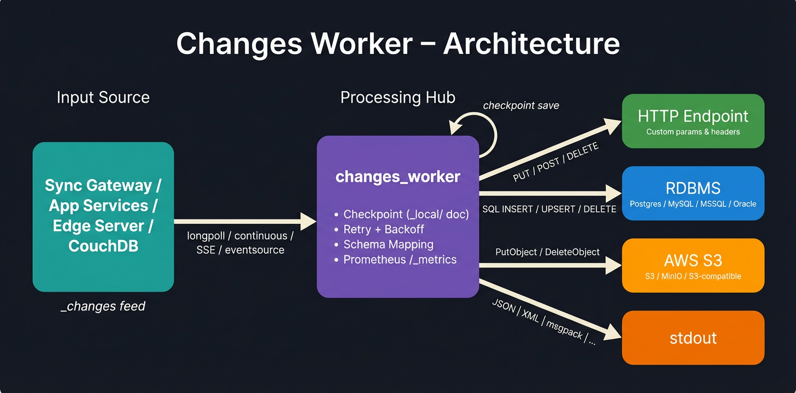

# Changes Worker  v1.5.0

A production-ready, async Python 3 processor for the `_changes` feed. It connects to **Sync Gateway**, **Capella App Services**, **Couchbase Edge Server**, or **Apache CouchDB**, consumes document changes via longpoll or continuous streaming, and forwards them to a downstream consumer — stdout, HTTP endpoint, RDBMS (PostgreSQL, MySQL, MS SQL, Oracle), or cloud blob storage (AWS S3, MinIO, S3-compatible).

Built for real-world workloads: checkpoint management so you never re-process, throttled feed consumption for large datasets, configurable retry with exponential backoff, and full async concurrency control.



---

## How It Works

```
┌──────────────────────┐         ┌──────────────────┐         ┌─────────────────────┐
│  Sync Gateway /      │         │                  │         │  HTTP Endpoint      │
│  App Services /      │ ──GET── │  changes_worker  │ ──PUT── │  (any REST API)     │
│  Edge Server /       │ _changes│                  │  POST   ├─────────────────────┤
│  CouchDB             │ ◄─JSON─ │  • Schema Mapping│  DELETE │  RDBMS              │
│                      │         │  • Serialize     │ ──────► │  (Postgres/MySQL/   │
│  /{db}/_changes      │         │  • Checkpoint    │         │   MSSQL/Oracle)     │
│                      │         │  • Dead Letter Q │         ├─────────────────────┤
│                      │         │  • CBL metadata  │         │  Cloud Storage      │
│                      │         │                  │         │  (AWS S3/MinIO)     │
│                      │         │                  │         ├─────────────────────┤
│                      │         │                  │         │  stdout             │
└──────────────────────┘         └──────────────────┘         └─────────────────────┘
```

1. **Consume** — Longpoll, continuous, or WebSocket `_changes` feed with auto-reconnect
2. **Filter** — Skip deletes, removes, or limit to specific channels
3. **Fetch** — Bulk or individual doc fetching when `include_docs=false`
4. **Map** — Schema mappings transform JSON documents into SQL rows, remapped JSON, etc.
5. **Forward** — Serialize (JSON, XML, msgpack, etc.) and send to stdout, HTTP, RDBMS, or S3
6. **Checkpoint** — Save `last_seq` as a `_local/` doc so restarts resume exactly where they left off

---

## Quick Start

### Prerequisites

- Python 3.11+
- A running Sync Gateway, Capella App Services, Edge Server, or CouchDB instance

### Install & Run

```bash
pip install -r requirements.txt

# Test connectivity first
python main.py --config config.json --test

# Run the worker
python main.py --config config.json
```

### Run with Docker

```bash
docker build -t changes-worker .

docker run --rm \
  -v $(pwd)/config.json:/app/config.json \
  changes-worker
```

### Run with Docker Compose

```bash
# Headless — worker + Prometheus metrics only (port 9090)
docker compose up --build

# With Admin UI — worker + metrics + web dashboard (ports 9090 + 8080)
docker compose --profile ui up --build
```

Set `"admin_ui": { "enabled": false }` in `config.json` for headless deployments where you only need `/_metrics` on port 9090.

| Flag | Description |
|---|---|
| `--config <path>` | Path to config.json (default: `config.json`) |
| `--test` | Test connectivity to source + output, then exit (exit code 0/1) |

---

## Key Features

| Feature | Description |
|---|---|
| **Multi-source** | Sync Gateway, App Services, Edge Server, CouchDB — automatic compatibility handling |
| **Multiple outputs** | stdout, HTTP endpoint, RDBMS (Postgres/MySQL/MSSQL/Oracle), AWS S3 (MinIO/S3-compatible) |
| **Feed modes** | Longpoll, continuous, WebSocket, SSE/EventSource |
| **Schema mapping** | Transform JSON docs into SQL table rows with 58 built-in transform functions |
| **Checkpoint** | CBL-style `_local/` doc checkpoints — never re-process on restart |
| **Dead letter queue** | Failed docs saved for later retry (CBL or JSONL file) |
| **Retry + backoff** | Configurable exponential backoff on both source and output sides |
| **Prometheus metrics** | Built-in `/_metrics` endpoint with pipeline, system, and runtime metrics |
| **Startup validation** | Every config setting validated before launch — clear error messages |
| **Dry run** | Process the feed and log what *would* be sent without sending |
| **Embedded storage** | Couchbase Lite CE for config, checkpoints, mappings, and DLQ in Docker |

📄 **Full feature details:** [`docs/FEATURES.md`](docs/FEATURES.md)

---

## Source Compatibility

| Capability | Sync Gateway | App Services | Edge Server | CouchDB |
|---|:---:|:---:|:---:|:---:|
| Feed types | longpoll, continuous, websocket | longpoll, continuous, websocket | longpoll, continuous, sse | longpoll, continuous, eventsource |
| `_bulk_get` | ✅ | ✅ | ❌ (individual GET) | ✅ |
| Bearer auth | ✅ | ✅ | ❌ | ✅ |
| Channels filter | ✅ | ✅ | ✅ | ❌ |
| Scoped keyspace | ✅ | ✅ | ✅ | ❌ |

📄 **Full compatibility matrix & auto-behaviors:** [`docs/SOURCE_TYPES.md`](docs/SOURCE_TYPES.md)

---

## Admin UI

A web-based admin dashboard at `http://localhost:8080`:

- **Dashboard** (`/`) — Real-time status indicators, live charts, auto-refresh
- **Settings** (`/settings`) — Form-based and raw JSON editing with save/reset
- **Schema Mappings** (`/schema`) — Visual drag-and-drop field mapping with transforms and AI assist
- **Setup Wizard** (`/wizard`) — 3-step guided setup: connect source → configure output → map fields
- **Glossary** (`/glossary`) — Reference for all 58 built-in transform functions

📄 **Full documentation:** [`docs/ADMIN_UI.md`](docs/ADMIN_UI.md)

---

## Project Structure

```
change_stream_db/
├── main.py                   # Main worker entry point
├── cbl_store.py              # Couchbase Lite CE storage layer
├── pipeline_logging.py       # Structured logging system
├── config.json               # Configuration (edit this)
├── requirements.txt          # Python dependencies
├── Dockerfile                # Container image (includes CBL-C 3.2.1)
├── docker-compose.yml        # Docker Compose setup
├── rest/
│   ├── changes_http.py       # _changes feed HTTP client logic
│   └── output_http.py        # HTTP output, dead letter queue, serialization
├── cloud/
│   ├── cloud_base.py         # Abstract base forwarder + CloudMetrics
│   └── cloud_s3.py           # AWS S3 / MinIO / S3-compatible output
├── db/
│   ├── db_base.py            # Base DB forwarder + schema mapping
│   ├── db_postgres.py        # PostgreSQL output
│   ├── db_mysql.py           # MySQL output
│   ├── db_mssql.py           # MS SQL Server output
│   └── db_oracle.py          # Oracle output
├── schema/
│   ├── mapper.py             # Schema mapper (JSON → SQL operations)
│   └── validator.py          # Mapping file validator
├── web/                      # Admin UI (server, templates, static assets)
├── tests/                    # Unit tests
└── docs/                     # Documentation (see below)
```

---

## Documentation

| Document | Description |
|---|---|
| [`docs/CONFIGURATION.md`](docs/CONFIGURATION.md) | Full `config.json` reference with all settings |
| [`docs/FEATURES.md`](docs/FEATURES.md) | Detailed feature documentation (feeds, output, metrics, etc.) |
| [`docs/SOURCE_TYPES.md`](docs/SOURCE_TYPES.md) | Source compatibility matrix and auto-behaviors |
| [`docs/DESIGN.md`](docs/DESIGN.md) | Architecture, pipeline design, failure modes |
| [`docs/SCHEMA_MAPPING.md`](docs/SCHEMA_MAPPING.md) | Schema mapping format and transforms |
| [`docs/ADMIN_UI.md`](docs/ADMIN_UI.md) | Admin dashboard documentation |
| [`docs/WIZARD.md`](docs/WIZARD.md) | Setup wizard guide |
| [`docs/CLOUD_BLOB_PLAN.md`](docs/CLOUD_BLOB_PLAN.md) | Cloud blob storage design document |
| [`docs/LOGGING.md`](docs/LOGGING.md) | Developer logging guide |
| [`docs/CBL_DATABASE.md`](docs/CBL_DATABASE.md) | Couchbase Lite database schema |

---

## License

See [LICENSE](LICENSE).
