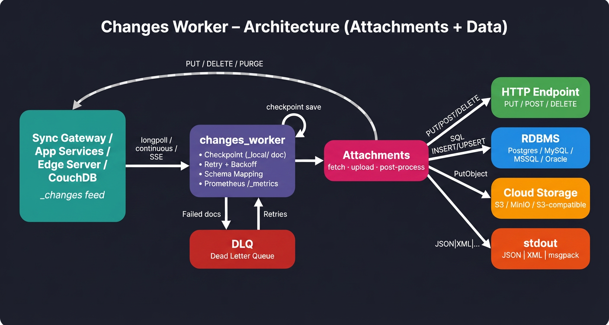

# PouchPipes 🥔📦 v2.2.1

<div align="center">
  
</div>

**Portable Over Unreliable Changes Handler that pipes CouchDB / Sync Gateway / Capella `_changes` feeds into clean, reliable downstream pipelines.**

A production-ready, async Python 3 processor for the Couchbase `_changes` feed. It connects to **Sync Gateway**, **Capella App Services**, **Couchbase Edge Server**, or **Apache CouchDB**, consumes document changes via longpoll or continuous streaming, and forwards them to a downstream consumer — stdout, HTTP endpoint, RDBMS (PostgreSQL, MySQL, MS SQL, Oracle), or cloud blob storage (AWS S3, MinIO, S3-compatible).

Built for real-world workloads: multi-job pipelines, checkpoint management so you never re-process, schema mapping with 58 transform functions, throttled feed consumption for large datasets, configurable retry with exponential backoff, and full async concurrency control.


When attachment processing is enabled, the pipeline includes an attachment stage:



---

## What's New in v2.0

v2.0 is a **major architecture redesign** that replaces the monolithic `config.json` with a **job-centric, composable document model** stored in Couchbase Lite collections.

- **Multi-job pipelines** — Run multiple independent `_changes` feed pipelines concurrently, each with its own source, output, schema mapping, and checkpoint.
- **Reusable inputs & outputs** — Define a source once, wire it to multiple outputs via jobs. No more duplicating config.
- **Job lifecycle control** — Start, stop, restart, and monitor individual jobs via REST API or the dashboard.
- **PipelineManager** — Thread-per-job orchestrator with crash detection, exponential-backoff restart, and graceful shutdown.
- **v1.x auto-migration** — Existing `config.json` is automatically migrated to the new model on first startup.

📄 **Full architecture details:** [`docs/DESIGN_2_0.md`](docs/DESIGN_2_0.md)  
📄 **Release notes:** [`RELEASE_NOTES.md`](RELEASE_NOTES.md)

---

## How It Works

```
┌──────────────────────┐         ┌──────────────────┐         ┌─────────────────────┐
│  Sync Gateway /      │         │                  │         │  HTTP Endpoint      │
│  App Services /      │ ──GET── │  changes_worker  │ ──PUT── │  (any REST API)     │
│  Edge Server /       │ _changes│                  │  POST   ├─────────────────────┤
│  CouchDB             │ ◄─JSON─ │  • Schema Mapping│  DELETE │  RDBMS              │
│                      │         │  • Serialize     │ ──────► │  (Postgres/MySQL/   │
│  /{db}/_changes      │         │  • Checkpoint    │         │   MSSQL/Oracle)     │
│                      │         │  • Dead Letter Q │         ├─────────────────────┤
│                      │         │  • Attachments   │         │  Cloud Storage      │
│                      │         │                  │         │  (AWS S3/MinIO)     │
│                      │         │                  │         ├─────────────────────┤
│                      │         │                  │         │  stdout             │
└──────────────────────┘         └──────────────────┘         └─────────────────────┘
```

1. **Consume** — Longpoll, continuous, or WebSocket `_changes` feed with auto-reconnect
2. **Filter** — Skip deletes, removes, or limit to specific channels
3. **Fetch** — Bulk or individual doc fetching when `include_docs=false`
4. **Map** — Schema mappings transform JSON documents into SQL rows, remapped JSON, etc.
5. **Attachments** *(optional)* — Detect, fetch, and upload document attachments to cloud storage, HTTP, or filesystem
6. **Forward** — Serialize (JSON, XML, msgpack, etc.) and send to stdout, HTTP, RDBMS, or S3
7. **Checkpoint** — Save `last_seq` as a `_local/` doc so restarts resume exactly where they left off

---

## Quick Start

### Prerequisites

- Python 3.11+
- A running Sync Gateway, Capella App Services, Edge Server, or CouchDB instance

### Install & Run

```bash
pip install -r requirements.txt

# Test connectivity first
python main.py --config config.json --test

# Run the worker
python main.py --config config.json
```

### Run with Docker

```bash
docker build -t changes-worker .

docker run --rm \
  -v $(pwd)/config.json:/app/config.json \
  changes-worker
```

### Run with Docker Compose

```bash
# Headless — worker + Prometheus metrics only (port 9090)
docker compose up --build

# With Admin UI — worker + metrics + web dashboard (ports 9090 + 8080)
docker compose --profile ui up --build
```

Set `"admin_ui": { "enabled": false }` in `config.json` for headless deployments where you only need `/_metrics` on port 9090.

### CLI

| Flag | Description |
|---|---|
| `--config <path>` | Path to config.json (default: `config.json`) |
| `--test` | Test connectivity to source + output, then exit (exit code 0/1) |
| `--version` | Print version and exit |

---

## Key Features

| Feature | Description |
|---|---|
| **Multi-job pipelines** | Run multiple independent `_changes` pipelines concurrently — each with its own source, output, mapping, and checkpoint |
| **Job lifecycle control** | Start, stop, restart, and monitor jobs via REST API or dashboard |
| **Multi-source** | Sync Gateway, App Services, Edge Server, CouchDB — automatic compatibility handling |
| **Multiple outputs** | stdout, HTTP endpoint, RDBMS (Postgres/MySQL/MSSQL/Oracle), AWS S3 (MinIO/S3-compatible) |
| **Feed modes** | Longpoll, continuous, WebSocket, SSE/EventSource |
| **Schema mapping** | Transform JSON docs into SQL table rows with 58 built-in transform functions |
| **Checkpoint** | CBL-style `_local/` doc checkpoints — never re-process on restart |
| **Dead letter queue** | Failed docs saved for later retry (CBL or JSONL file) |
| **Attachment processing** | Detect, fetch, and upload document attachments to S3, HTTP, or filesystem with optional post-processing |
| **Retry + backoff** | Configurable exponential backoff on both source and output sides |
| **Prometheus metrics** | Built-in `/_metrics` endpoint with pipeline, system, and runtime metrics |
| **Admin UI** | Web dashboard with real-time monitoring, job management, schema editor, and setup wizard |
| **Startup validation** | Every config setting validated before launch — clear error messages |
| **Dry run** | Process the feed and log what *would* be sent without sending |
| **Embedded storage** | Couchbase Lite CE for config, checkpoints, mappings, and DLQ in Docker |
| **Structured logging** | SG-inspired log keys, per-key levels, file rotation, and sensitive data redaction |

📄 **Full feature details:** [`docs/FEATURES.md`](docs/FEATURES.md)

---

## Source Compatibility

| Capability | Sync Gateway | App Services | Edge Server | CouchDB |
|---|:---:|:---:|:---:|:---:|
| Feed types | longpoll, continuous, websocket | longpoll, continuous, websocket | longpoll, continuous, sse | longpoll, continuous, eventsource |
| `_bulk_get` | ✅ | ✅ | ❌ (individual GET) | ✅ |
| Bearer auth | ✅ | ✅ | ❌ | ✅ |
| Session cookie auth | ✅ | ✅ | ❌ | ❌ |
| Channels filter | ✅ | ✅ | ✅ | ❌ |
| `active_only` | ✅ | ✅ | ✅ | ❌ |
| Scoped keyspace | ✅ | ✅ | ✅ | ❌ |

📄 **Full compatibility matrix & auto-behaviors:** [`docs/SOURCE_TYPES.md`](docs/SOURCE_TYPES.md)

---

## v2.0 Job Architecture

In v2.0, the monolithic `config.json` is replaced by a composable document model:

```
┌───────────────┐     ┌───────────────┐     ┌───────────────┐
│  Input A      │     │   Job 1       │     │  Output X     │
│  (SG prices)  │────►│  A → X        │────►│  (PostgreSQL) │
└───────────────┘     │  + mapping    │     └───────────────┘
                      └───────────────┘
┌───────────────┐     ┌───────────────┐     ┌───────────────┐
│  Input A      │     │   Job 2       │     │  Output Y     │
│  (SG prices)  │────►│  A → Y        │────►│  (HTTP API)   │
└───────────────┘     │  + mapping    │     └───────────────┘
                      └───────────────┘
┌───────────────┐     ┌───────────────┐     ┌───────────────┐
│  Input B      │     │   Job 3       │     │  Output X     │
│  (SG orders)  │────►│  B → X        │────►│  (PostgreSQL) │
└───────────────┘     │  + mapping    │     └───────────────┘
                      └───────────────┘
```

- **Inputs** — Reusable `_changes` feed source definitions (host, auth, feed settings)
- **Outputs** — Reusable output configs by type: RDBMS, HTTP, Cloud (S3), stdout
- **Jobs** — Connect one input → one output with a schema mapping, checkpoint, and lifecycle

Each job runs in its own thread with an isolated asyncio event loop, HTTP session, and checkpoint.

📄 **Document model & collections:** [`docs/DESIGN_2_0.md`](docs/DESIGN_2_0.md)  
📄 **Job lifecycle & document schema:** [`docs/JOBS.md`](docs/JOBS.md)

---

## REST API

### Job Control (v2.0)

| Method | Path | Description |
|---|---|---|
| `GET` | `/api/jobs` | List all jobs with state |
| `GET` | `/api/jobs/{id}` | Get a single job |
| `POST` | `/api/jobs` | Create a new job |
| `PUT` | `/api/jobs/{id}` | Update a job |
| `DELETE` | `/api/jobs/{id}` | Delete a job |
| `POST` | `/api/jobs/{id}/start` | Start a job |
| `POST` | `/api/jobs/{id}/stop` | Graceful stop |
| `POST` | `/api/jobs/{id}/restart` | Stop + start |
| `GET` | `/api/jobs/{id}/state` | Job status, uptime, error count |
| `POST` | `/api/_restart` | Restart all jobs |
| `POST` | `/api/_offline` | Stop all jobs (keep config) |
| `POST` | `/api/_online` | Resume all jobs after offline |

### Inputs & Outputs CRUD (v2.0)

| Method | Path | Description |
|---|---|---|
| `GET` | `/api/inputs_changes` | Get all input definitions |
| `POST` | `/api/inputs_changes` | Save inputs document |
| `PUT` | `/api/inputs_changes/{id}` | Update one input entry |
| `DELETE` | `/api/inputs_changes/{id}` | Delete one input entry |
| `GET` | `/api/outputs_{type}` | Get outputs (`type` = `rdbms`, `http`, `cloud`, `stdout`) |
| `POST` | `/api/outputs_{type}` | Save outputs document |
| `PUT` | `/api/outputs_{type}/{id}` | Update one output entry |
| `DELETE` | `/api/outputs_{type}/{id}` | Delete one output entry |

### Infrastructure

| Method | Path | Description |
|---|---|---|
| `GET` | `/api/config` | Get infrastructure config |
| `POST` | `/api/config` | Save infrastructure config |
| `GET` | `/_metrics` | Prometheus metrics endpoint |
| `GET` | `/_status` | Health check |

---

## Admin UI

A web-based admin dashboard at `http://localhost:8080`:

| Page | Path | Description |
|---|---|---|
| **Dashboard** | `/` | Multi-job status table with per-job start/stop/restart controls, live charts, architecture diagram |
| **Settings** | `/settings` | Infrastructure config (logging, metrics, admin UI, CBL, shutdown) |
| **Schema Mappings** | `/schema` | Visual drag-and-drop field mapping with transforms, AI assist, and coverage stats |
| **Setup Wizard** | `/wizard` | Guided setup: connect source → configure output → map fields → create job |
| **Logs** | `/logs` | Real-time log viewer with job filter, log key filter, and level filter |
| **Dead Letter Queue** | `/dlq` | Browse, retry, and purge failed documents with job and reason filtering |
| **Glossary** | `/glossary` | Reference for all 58 built-in transform functions |
| **Help** | `/help` | Documentation and getting started guide |

📄 **Full documentation:** [`docs/ADMIN_UI.md`](docs/ADMIN_UI.md)

---

## One Process Per Collection

Each job monitors exactly one scope/collection. To process multiple collections, create multiple jobs:

```
                ┌──────────────────────────────────────┐
                │          changes_worker (v2.0)       │
                │                                      │
config.json ──► │  PipelineManager                     │
                │    ├── Thread 1: Job "prices→PG"     │
                │    │     └── us.prices _changes      │
                │    ├── Thread 2: Job "orders→PG"     │
                │    │     └── us.orders _changes      │
                │    └── Thread 3: Job "prices→HTTP"   │
                │          └── us.prices _changes      │
                │                                      │
                │  Shared: metrics :9090, UI :8080,    │
                │          CBL store, maintenance      │
                └──────────────────────────────────────┘
```

---

## Project Structure

```
change_stream_db/
├── main.py                   # Main worker entry point + poll_changes logic
├── pipeline.py               # Per-job thread wrapper (v2.0)
├── pipeline_manager.py       # Multi-job thread orchestrator (v2.0)
├── pipeline_logging.py       # Structured logging (log keys, redaction, rotation)
├── cbl_store.py              # Couchbase Lite CE storage layer (v2.0 collections)
├── config.json               # Configuration (v1.x format, auto-migrated to v2.0)
├── requirements.txt          # Python dependencies
├── Dockerfile                # Container image (includes CBL-C 3.2.1)
├── docker-compose.yml        # Docker Compose setup
├── rest/
│   ├── api_v2.py             # v2.0 REST API: inputs, outputs, jobs CRUD
│   ├── api_v2_jobs_control.py# Job lifecycle endpoints (start/stop/restart)
│   ├── changes_http.py       # _changes feed HTTP client logic
│   ├── output_http.py        # HTTP output, dead letter queue, serialization
│   ├── attachments.py        # Attachment processor orchestrator
│   ├── attachment_config.py  # Attachment configuration parser
│   ├── attachment_stream.py  # Streaming attachment download
│   ├── attachment_upload.py  # Upload to S3/HTTP/filesystem
│   ├── attachment_multipart.py # Multipart attachment handling
│   └── attachment_postprocess.py # Post-upload actions (update doc, delete, purge)
├── cloud/
│   ├── cloud_base.py         # Abstract base forwarder + CloudMetrics
│   └── cloud_s3.py           # AWS S3 / MinIO / S3-compatible output
├── db/
│   ├── db_base.py            # Base DB forwarder + schema mapping
│   ├── db_postgres.py        # PostgreSQL output
│   ├── db_mysql.py           # MySQL output
│   ├── db_mssql.py           # MS SQL Server output
│   └── db_oracle.py          # Oracle output
├── schema/
│   ├── mapper.py             # Schema mapper (JSON → SQL operations)
│   └── validator.py          # Mapping file validator
├── web/
│   ├── server.py             # Web server module
│   ├── templates/            # Admin UI HTML pages (8 pages)
│   └── static/               # CSS, JS, icons, favicon
├── mappings/                 # Schema mapping files (JSON)
├── tests/                    # Unit tests (24 test files, 775+ tests)
├── docs/                     # Documentation (22 docs)
├── img/                      # Architecture diagrams
├── guide/                    # Developer guides (release checklist, style guide)
├── logs/                     # Log output (gitignored)
└── release_works/            # Release planning documents
```

---

## Documentation

| Document | Description |
|---|---|
| [`docs/DESIGN_2_0.md`](docs/DESIGN_2_0.md) | **v2.0 architecture**: job model, CBL collections, PipelineManager, phases |
| [`docs/JOBS.md`](docs/JOBS.md) | Job document schema, lifecycle, and checkpoint isolation |
| [`docs/UI_JOBS_MANAGEMENT.md`](docs/UI_JOBS_MANAGEMENT.md) | Multi-job UI design: dashboard, logs, DLQ filtering |
| [`docs/CONFIGURATION.md`](docs/CONFIGURATION.md) | Full `config.json` reference with all settings |
| [`docs/FEATURES.md`](docs/FEATURES.md) | Detailed feature documentation (feeds, output, metrics, etc.) |
| [`docs/SOURCE_TYPES.md`](docs/SOURCE_TYPES.md) | Source compatibility matrix and auto-behaviors |
| [`docs/DESIGN.md`](docs/DESIGN.md) | Pipeline architecture, failure modes, checkpoint strategies |
| [`docs/SCHEMA_MAPPING.md`](docs/SCHEMA_MAPPING.md) | Schema mapping format, transforms, and examples |
| [`docs/ADMIN_UI.md`](docs/ADMIN_UI.md) | Admin dashboard documentation |
| [`docs/WIZARD.md`](docs/WIZARD.md) | Setup wizard guide |
| [`docs/ATTACHMENTS.md`](docs/ATTACHMENTS.md) | Attachment processing: modes, detection, fetch, upload, post-process |
| [`docs/CLOUD_BLOB_PLAN.md`](docs/CLOUD_BLOB_PLAN.md) | Cloud blob storage design document |
| [`docs/LOGGING.md`](docs/LOGGING.md) | Structured logging: log keys, redaction, rotation, TRACE level |
| [`docs/DLQ.md`](docs/DLQ.md) | Dead letter queue: lifecycle, replay, retention |
| [`docs/CBL_DATABASE.md`](docs/CBL_DATABASE.md) | Couchbase Lite database schema |
| [`docs/CBL_STORE.md`](docs/CBL_STORE.md) | CBL store API reference |
| [`docs/CHANGES_PROCESSING.md`](docs/CHANGES_PROCESSING.md) | Changes feed processing internals |
| [`docs/DEBUGGING.md`](docs/DEBUGGING.md) | Debugging and troubleshooting guide |
| [`docs/RDBMS_IMPLEMENTATION.md`](docs/RDBMS_IMPLEMENTATION.md) | RDBMS output implementation details |
| [`docs/HA.md`](docs/HA.md) | High Availability via CBL replication (v3.0 roadmap) |
| [`docs/MULTI_PIPELINE_PLAN.md`](docs/MULTI_PIPELINE_PLAN.md) | Multi-pipeline threading design reference |
| [`guide/RELEASE.md`](guide/RELEASE.md) | Release checklist and best practices |

---

## Upgrading from v1.x

v2.0 is backward compatible at startup. On first run, the worker automatically migrates your existing `config.json` into the new document model:

1. Creates an input entry from `gateway` + `auth` + `changes_feed`
2. Creates an output entry from `output`
3. Creates a default job connecting them
4. Preserves your checkpoint

Your original `config.json` is **not modified** — you can roll back to v1.7.0 at any time. See the [RELEASE_NOTES.md](RELEASE_NOTES.md) for rollback details.

---

## License

See [LICENSE](LICENSE).
