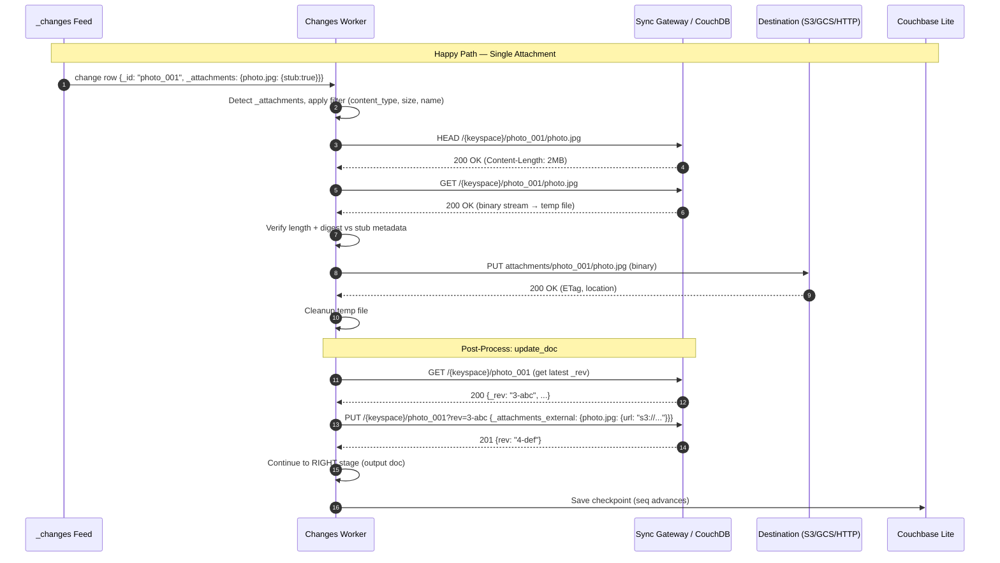
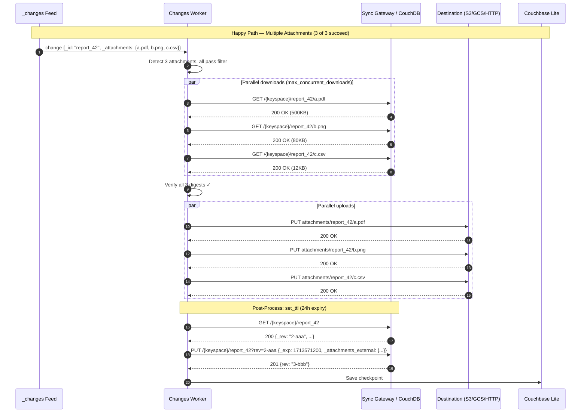
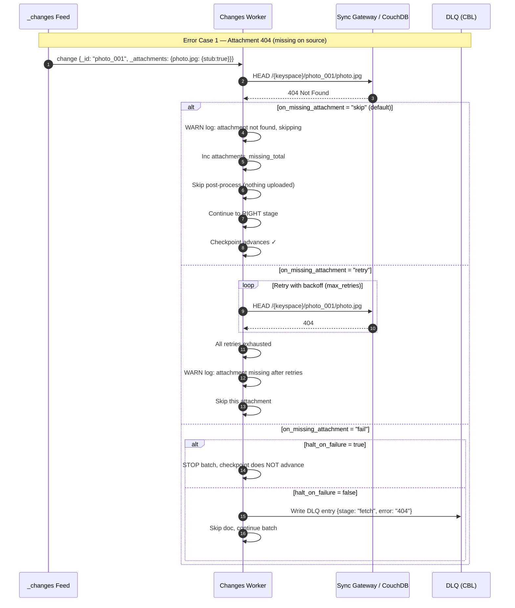
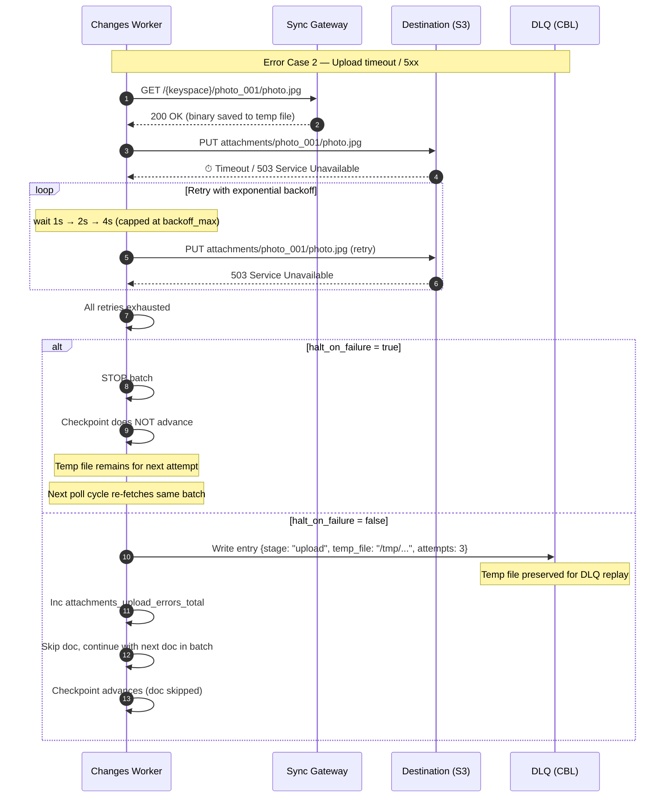
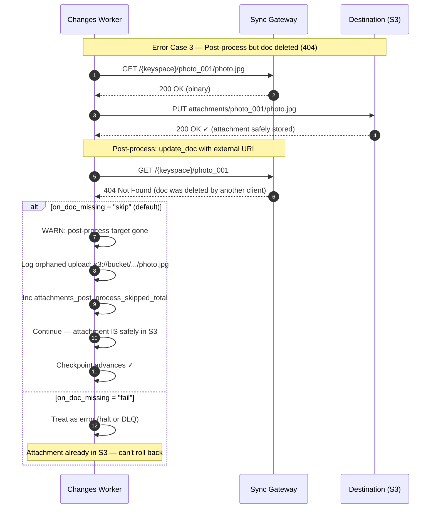
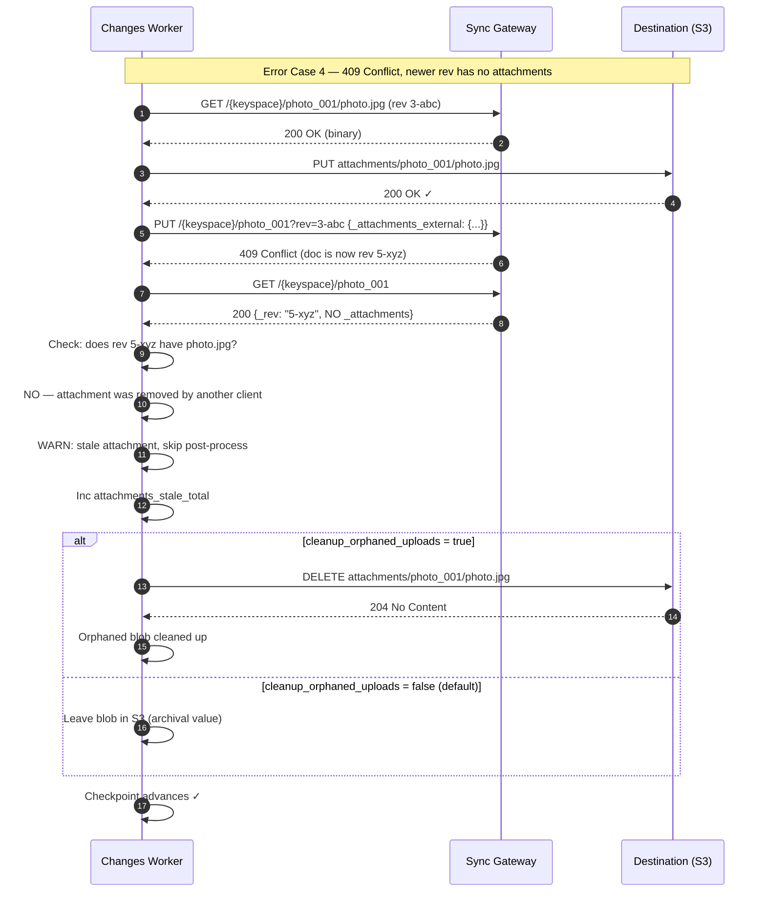
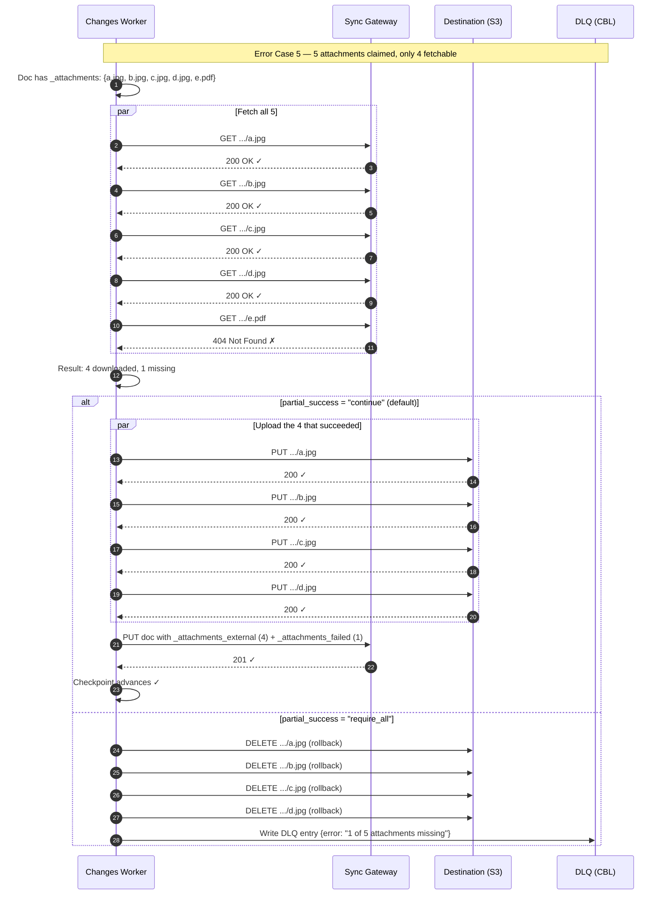
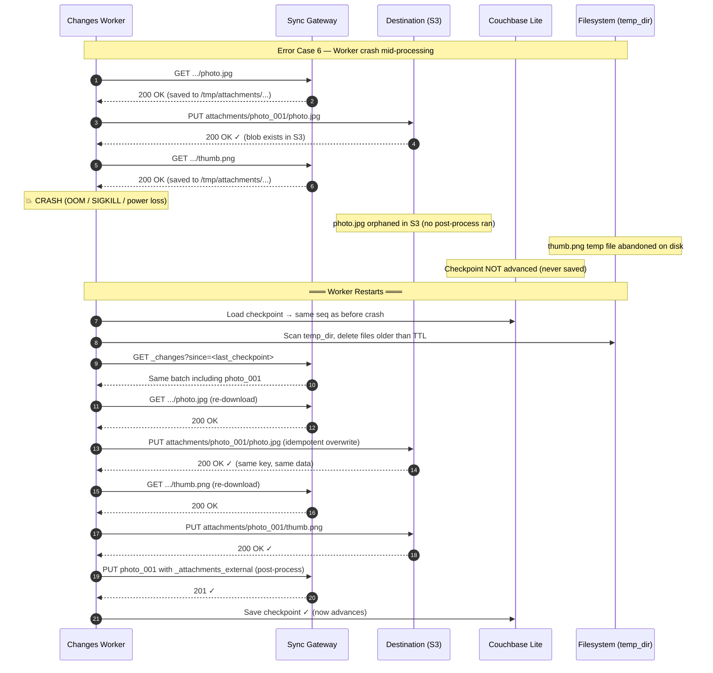
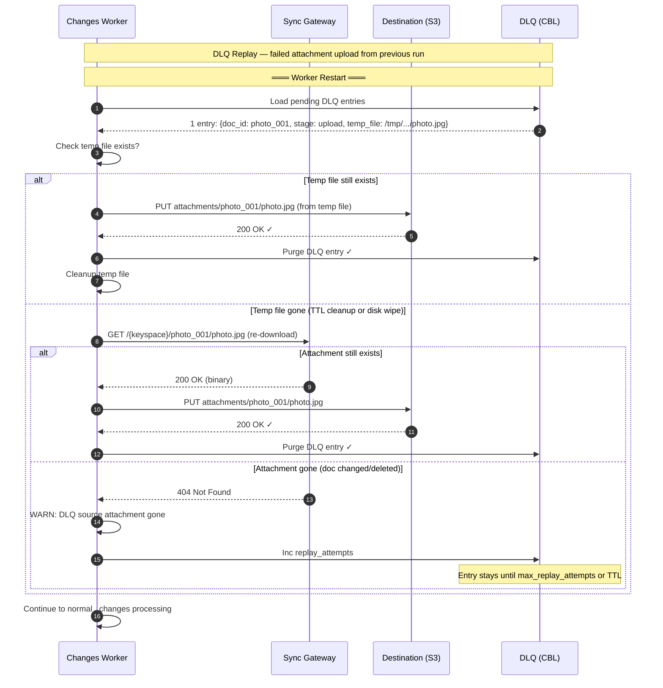
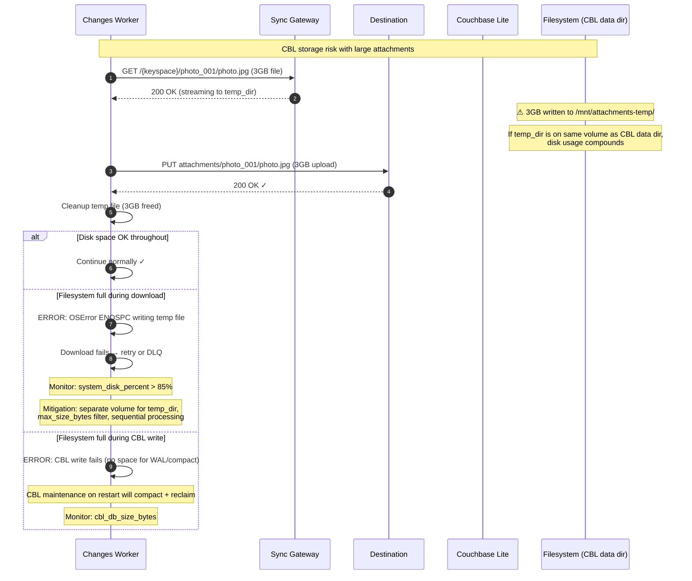

# Attachments Processing – Design Plan

A common use of consuming the `_changes` feed is to process Couchbase and CouchDB attachments. The typical workflow is: listen to the `_changes` feed, detect documents with attachments, download the attachment binaries, and copy them to another system (cloud blob storage, file system, CDN, etc.).

After processing the attachments, a secondary operation is usually performed on the source document:

1. **Update the document** — `PUT /{keyspace}/{docId}` with the external URL/location of the attachment added to the document body
2. **Set TTL (Couchbase only)** — `PUT /{keyspace}/{docId}?_exp=<ttl>` to expire the document after a time-to-live period
3. **Delete the whole document** — `DELETE /{keyspace}/{docId}?rev=<rev>` to remove the document that held the attachment
4. **Delete only the attachment(s)** — `DELETE /{keyspace}/{docId}/{attachment_name}?rev=<rev>` to remove individual attachments while keeping the document

**Related docs:**
- [`DESIGN.md`](DESIGN.md) – Overall pipeline architecture, three-stage pipeline, failure modes
- [`CLOUD_BLOB_PLAN.md`](CLOUD_BLOB_PLAN.md) – Cloud blob storage output (S3, GCS, Azure) — natural destination for extracted attachments
- [`CHANGES_PROCESSING.md`](CHANGES_PROCESSING.md) – `_changes` feed processing, checkpoint strategy
- [`DLQ.md`](DLQ.md) – Dead letter queue for failed attachment operations

---

## Source Platform Support

| Platform | Attachment API | Notes |
|---|---|---|
| **Sync Gateway / App Services** | ✅ Full API | GET/PUT/DELETE individual attachments, `_bulk_get` with attachments, `_bulk_docs` with inline attachments |
| **CouchDB** | ✅ Full API | GET/PUT/DELETE individual attachments, `_bulk_get` with attachments, `_bulk_docs` with inline attachments |
| **Edge Server** | ❌ **No attachment API** | Edge Server has no attachment endpoints — attachments are not available. See [Edge Server Workarounds](#edge-server-workarounds) for alternatives. |

---

## API Reference

### Couchbase Sync Gateway / App Services (Port 4984 Public, Port 4985 Admin)

| Operation | Method | Endpoint | Reference |
|---|---|---|---|
| Get attachment | `GET` | `/{keyspace}/{docid}/{attach}` | [REST API — Get an attachment](https://docs.couchbase.com/sync-gateway/current/rest-api/rest_api_public.html#tag/Document-Attachment) |
| Put attachment | `PUT` | `/{keyspace}/{docid}/{attach}?rev=<rev>` | [REST API — Put an attachment](https://docs.couchbase.com/sync-gateway/current/rest-api/rest_api_public.html#tag/Document-Attachment) |
| Head/ping attachment | `HEAD` | `/{keyspace}/{docid}/{attach}` | [REST API — Check if attachment exists](https://docs.couchbase.com/sync-gateway/current/rest-api/rest_api_public.html#tag/Document-Attachment/operation/head_keyspace-docid-attach) |
| Delete attachment | `DELETE` | `/{keyspace}/{docid}/{attach}?rev=<rev>` | [REST API — Delete an attachment](https://docs.couchbase.com/sync-gateway/current/rest-api/rest_api_public.html#tag/Document-Attachment) |
| Get document (with attachments) | `GET` | `/{keyspace}/{docid}?attachments=true` | [REST API — Get a document](https://docs.couchbase.com/sync-gateway/current/rest-api/rest_api_public.html#tag/Document/operation/get_keyspace-docid) |
| Bulk get (with attachments) | `POST` | `/{keyspace}/_bulk_get?attachments=true` | [REST API — Bulk get](https://docs.couchbase.com/sync-gateway/current/rest-api/rest_api_public.html#tag/Document/operation/post_keyspace-_bulk_get) |
| Bulk docs (inline attachments) | `POST` | `/{keyspace}/_bulk_docs` | [REST API — Bulk docs](https://docs.couchbase.com/sync-gateway/current/rest-api/rest_api_public.html#tag/Document/operation/post_keyspace-_bulk_docs) |
| Delete document | `DELETE` | `/{keyspace}/{docid}?rev=<rev>` | [REST API — Delete a document](https://docs.couchbase.com/sync-gateway/current/rest-api/rest_api_public.html#tag/Document/operation/delete_keyspace-docid) |
| Purge document (Admin only, port 4985) | `POST` | `/{keyspace}/_purge` | [Admin REST API — Purge](https://docs.couchbase.com/sync-gateway/current/rest-api/rest_api_admin.html#tag/Document/operation/post_keyspace-_purge) |

### CouchDB

| Operation | Method | Endpoint | Reference |
|---|---|---|---|
| Get attachment | `GET` | `/{db}/{docid}/{attach}` | [CouchDB API — Attachments](https://docs.couchdb.org/en/stable/api/document/common.html#attachments) |
| Put attachment | `PUT` | `/{db}/{docid}/{attach}?rev=<rev>` | [CouchDB API — Attachments](https://docs.couchdb.org/en/stable/api/document/common.html#attachments) |
| Head/ping attachment | `HEAD` | `/{db}/{docid}/{attach}` | [CouchDB API — Attachments](https://docs.couchdb.org/en/stable/api/document/common.html#attachments) |
| Delete attachment | `DELETE` | `/{db}/{docid}/{attach}?rev=<rev>` | [CouchDB API — Attachments](https://docs.couchdb.org/en/stable/api/document/common.html#attachments) |
| Get document (with attachments) | `GET` | `/{db}/{docid}?attachments=true` | [CouchDB API — Documents](https://docs.couchdb.org/en/stable/api/document/common.html#attachments) |
| Bulk get (with attachments) | `POST` | `/{db}/_bulk_get` | [CouchDB API — Bulk get](https://docs.couchbase.com/couchdb/current/api/database/bulk-api.html#db-bulk-get) |
| Bulk docs (inline attachments) | `POST` | `/{db}/_bulk_docs` | [CouchDB API — Bulk docs](https://docs.couchdb.org/en/stable/api/database/bulk-api.html#db-bulk-docs) |
| Delete document | `DELETE` | `/{db}/{docid}?rev=<rev>` | [CouchDB API — Documents](https://docs.couchdb.org/en/stable/api/document/common.html#attachments) |
| Purge document | `POST` | `/{db}/_purge` | [CouchDB API — Purge](https://docs.couchdb.org/en/stable/api/database/misc.html) |

### Couchbase Lite (CBL) — Blob Storage

Couchbase Lite uses **blobs** instead of "attachments." Blobs are stored as **files on disk** within the CBL database directory, with metadata (size, content_type, digest) tracked in the document JSON. CBL blobs are **not accessed via REST API** — they exist only in the local CBL database and are synced via replication to a Couchbase Server/Sync Gateway, which makes them accessible as standard Sync Gateway attachments.

| Operation | Context | Details |
|---|---|---|
| **Write blob** | CBL local | Document contains a `Blob` object: `doc["photo"] = Blob(contentType: "image/jpeg", data: bytes)`. Blob is stored in filesystem, reference in doc metadata. |
| **Read blob** | CBL local | `blob = doc["photo"].blob; data = blob.content` — read from filesystem. |
| **Sync to gateway** | Replication | Blobs are synced to Sync Gateway as standard attachments, appearing in `_attachments` on the SG side. |
| **Download from gateway** | Pull replication | Worker receives documents from SG via `_changes` or replication. Blobs are replicated back to CBL local storage. |
| **Query blobs in CBL** | Metadata only | CBL N1QL can query blob metadata (size, content_type) but not blob contents. Cannot filter by blob data directly. |

**Key difference from Sync Gateway/CouchDB:** CBL blobs have **no REST API** — they are local filesystem objects. If the worker is consuming from a **CBL database directly** (via SDK), blobs are accessed in-process. If consuming from **Sync Gateway (which is replicating from CBL)**, the blobs appear as standard `_attachments` stubs and are fetched via the Sync Gateway REST API (see table above).

**Blob metadata in CBL document:**

```json
{
  "_id": "photo_001",
  "photo": {
    "@type": "blob",
    "content_type": "image/jpeg",
    "digest": "sha1-abc123==",
    "length": 2048576
  }
}
```

When synced to Sync Gateway, this becomes an entry in `_attachments`:

```json
{
  "_id": "photo_001",
  "_attachments": {
    "photo": {
      "content_type": "image/jpeg",
      "digest": "sha1-abc123==",
      "length": 2048576,
      "stub": true
    }
  }
}
```

---

## Attachment Detection

When a document arrives via `_changes`, attachment metadata appears in the `_attachments` field as stubs:

```json
{
  "_id": "photo_001",
  "_rev": "3-abc123",
  "_attachments": {
    "photo.jpg": {
      "content_type": "image/jpeg",
      "digest": "md5-abc123==",
      "length": 2048576,
      "revpos": 2,
      "stub": true
    },
    "thumbnail.png": {
      "content_type": "image/png",
      "digest": "md5-def456==",
      "length": 8192,
      "revpos": 3,
      "stub": true
    }
  },
  "title": "Vacation Photo"
}
```

The worker detects documents with attachments by checking for a non-empty `_attachments` field. When `stub: true`, the attachment body is not included — it must be fetched separately.

---

## Design: Attachment Processing Pipeline

The attachment processor extends the existing three-stage pipeline (LEFT → MIDDLE → RIGHT) by adding an **ATTACHMENT stage** between MIDDLE and RIGHT:

```
┌─────────────┐     ┌────────────┐     ┌──────────────────┐     ┌─────────────┐
│   LEFT      │     │  MIDDLE    │     │  ATTACHMENT      │     │  RIGHT      │
│  _changes   │────►│  filter /  │────►│  detect / fetch  │────►│  output     │
│  feed       │     │  fetch doc │     │  / upload / post │     │  (original) │
└─────────────┘     └────────────┘     └──────────────────┘     └─────────────┘
```

### ATTACHMENT Stage Flow

```
Document arrives with _attachments stubs
    │
    ▼
┌──────────────────────────────────┐
│ 1. DETECT                        │
│    Does doc have _attachments?   │
│    Does it match attachment       │
│    filter (content_type, size)?  │
└──────────────┬───────────────────┘
               │ yes
               ▼
┌──────────────────────────────────┐
│ 2. FETCH                         │
│    GET /{keyspace}/{docid}/{att} │
│    (or _bulk_get?attachments=true│
│    if fetching all at once)      │
└──────────────┬───────────────────┘
               │
               ▼
┌──────────────────────────────────┐
│ 3. UPLOAD                        │
│    Upload binary to destination  │
│    (cloud blob, filesystem, CDN, │
│    REST endpoint)                │
└──────────────┬───────────────────┘
               │
               ▼
┌──────────────────────────────────┐
│ 4. POST-PROCESS (optional)       │
│    One of:                       │
│    a) Update doc with ext URL    │
│    b) Set TTL (_exp)             │
│    c) Delete the document        │
│    d) Delete the attachment(s)   │
│    e) Purge the document (admin) │
│    f) Do nothing                 │
└──────────────────────────────────┘
```

---

## Config Changes

Attachment processing is configured via a new `attachments` block in the config:

```jsonc
{
  "attachments": {
    "enabled": false,                         // master switch (default: disabled)
    "dry_run": false,                         // detect + fetch + upload but skip post-processing
                                              // and do NOT advance checkpoint (safe for testing)
    "mode": "individual",                     // "individual" | "bulk" | "multipart" — fetch strategy

    // --- Filtering ---
    "filter": {
      "content_types": [],                    // e.g., ["image/*", "application/pdf"] — empty = all
      "reject_content_types": [],             // e.g., ["application/x-msdownload", "application/x-executable"]
                                              // reject dangerous/unwanted MIME types before download
      "min_size_bytes": 0,                    // skip attachments smaller than this
      "max_size_bytes": 0,                    // skip attachments larger than this (0 = no limit)
      "max_total_bytes_per_doc": 0,           // skip doc if sum of all attachments exceeds this (0 = no limit)
                                              // prevents one monster doc from OOMing or filling temp volume
      "name_pattern": "",                     // regex pattern to match attachment names (empty = all)
      "ignore_revpos": false                  // if true, re-process attachments even if revpos hasn't changed
                                              // useful when you want to re-extract on every doc update
    },

    // --- Fetch ---
    "fetch": {
      "use_bulk_get": false,                  // true = fetch all attachments via _bulk_get?attachments=true
      "max_concurrent_downloads": 5,          // parallel attachment downloads PER DOCUMENT
      "max_concurrent_downloads_global": 20,  // parallel attachment downloads across ALL docs in a batch
                                              // prevents SG thread pool saturation when multiple workers run
      "request_timeout_seconds": 120,         // timeout for large attachment downloads
      "temp_dir": "/tmp/attachments",         // temporary directory for streaming large files
      "verify_digest": true,                  // check digest after download (default: true)
      "verify_length": true                   // check Content-Length vs stub length (default: true)
    },

    // --- Upload Destination ---
    "destination": {
      "type": "s3",                           // "s3" | "gcs" | "azure" | "http" | "filesystem"
      "key_template": "{prefix}/{doc_id}/{attachment_name}",
      "key_prefix": "attachments",

      // Reuses the existing output.s3 / output.gcs / output.azure config blocks
      // OR a destination-specific override:
      "s3": {
        "bucket": "my-attachments-bucket",
        "region": "us-east-1"
        // ... same fields as output.s3
      },
      "http": {
        "url_template": "https://cdn.example.com/upload/{doc_id}/{attachment_name}",
        "method": "PUT",
        "headers": {}
      },
      "filesystem": {
        "base_path": "/mnt/attachments",
        "dir_template": "{doc_id}",
        "preserve_filename": true
      },

      // --- Pre-signed URLs (S3/GCS only) ---
      "presigned_urls": {
        "enabled": false,                     // generate pre-signed URLs instead of direct bucket URLs
        "expiry_seconds": 604800              // pre-signed URL expiry (default: 7 days)
                                              // use when downstream consumers (mobile/web) lack IAM permissions
      }
    },

    // --- Post-Processing ---
    "post_process": {
      "action": "none",                       // "none" | "update_doc" | "set_ttl" | "delete_doc"
                                              // | "delete_attachments" | "purge"
                                              // Can also be an ARRAY to chain actions:
                                              // ["update_doc", "set_ttl"] — update doc with URL, then set expiry

      // action = "update_doc": add external URL to the document
      "update_field": "_attachments_external", // field name to add/update with external URLs
      "remove_attachments_after_upload": false, // if true, remove _attachments from the doc body on update

      // action = "set_ttl": set document expiry (Couchbase only)
      "ttl_seconds": 86400,                   // time-to-live in seconds (e.g., 24 hours)

      // action = "purge": requires admin port access
      // ⚠️ SECURITY: Use environment variables or a secret manager for admin credentials
      //    in production. Never commit admin_auth credentials to source control.
      "admin_url": "",                        // e.g., "http://localhost:4985" (admin port)
      "admin_auth": {                         // separate auth for admin port
        "method": "basic",
        "username": "",                       // prefer env var: ATTACHMENTS_ADMIN_USERNAME
        "password": ""                        // prefer env var: ATTACHMENTS_ADMIN_PASSWORD
      }
    },

    // --- Retry & Error Handling ---
    "retry": {
      "max_retries": 3,
      "backoff_base_seconds": 1,
      "backoff_max_seconds": 30
    },
    "halt_on_failure": true,                  // stop processing if attachment ops fail
    "skip_on_edge_server": true               // auto-skip when src=edge_server (no attachment API)
  }
}
```

### Key Template Placeholders

| Placeholder | Description | Example Value |
|---|---|---|
| `{doc_id}` | Document ID (`_id` field) | `photo_001` |
| `{attachment_name}` | Attachment filename from `_attachments` key | `photo.jpg` |
| `{content_type}` | MIME type of the attachment | `image/jpeg` |
| `{rev}` | Document revision at time of fetch | `3-abc123` |
| `{revpos}` | Revision number when attachment was added | `2` |
| `{prefix}` | The `key_prefix` config value | `attachments` |
| `{scope}` | Couchbase scope name | `us` |
| `{collection}` | Couchbase collection name | `prices` |
| `{database}` | Couchbase database name | `db` |
| `{digest}` | Attachment digest from stub | `md5-abc123==` |
| `{length}` | Attachment size in bytes | `2048576` |
| `{timestamp}` | Unix epoch seconds at upload time | `1768521600` |
| `{iso_date}` | ISO 8601 date-time | `2026-04-18T12:00:00Z` |
| `{year}` / `{month}` / `{day}` | Date components | `2026` / `04` / `18` |

> **⚠️ Crash safety:** Use only `{doc_id}` and `{attachment_name}` for idempotent keys. Adding `{timestamp}` or `{rev}` creates different keys on retry, resulting in duplicate blobs. See [Corner Case 6](#corner-case-6-worker-crashes-mid-attachment-processing).

---

## Fetch Strategies

### Individual Fetch (`mode: "individual"`)

Fetches each attachment separately. Best for selective processing (only certain content types or names):

```
GET /{keyspace}/{docId}/photo.jpg
GET /{keyspace}/{docId}/thumbnail.png
```

- Allows parallel downloads per document (`max_concurrent_downloads`)
- Respects content_type / size / name filters — skips non-matching attachments without downloading
- Can HEAD-check attachment existence before downloading (`HEAD /{keyspace}/{docId}/{attach}`)

### Bulk Fetch (`mode: "bulk"`)

Fetches the full document with all attachment bodies inline via `_bulk_get`:

```
POST /{keyspace}/_bulk_get?attachments=true
Body: {"docs": [{"id": "photo_001"}]}
```

- Fewer HTTP round-trips for documents with many attachments
- Attachments arrive base64-encoded in the JSON response
- **Trade-off:** Downloads ALL attachments even if filters would skip some
- **Trade-off:** Higher memory usage — all attachment data is in memory as base64
- **Trade-off:** Base64 encoding increases data size by **~33%** and spikes CPU during decode

### Multipart/Related Fetch (`mode: "multipart"`)

Fetches the document with all attachments in a single HTTP request using `multipart/related` format:

```
GET /{keyspace}/{docId}?attachments=true
Accept: multipart/related
```

- **No Base64 overhead** — attachment binaries arrive as raw MIME parts, not base64-encoded
- Single HTTP round-trip per document (like bulk, but without the 33% encoding tax)
- The response is a multipart MIME stream: first part is the JSON document, subsequent parts are raw attachment binaries
- **Trade-off:** More complex response parsing (MIME boundary splitting)
- **Trade-off:** Downloads ALL attachments (like bulk — no per-attachment filtering)
- **Best for:** Documents with many large attachments where you need all of them and want to avoid the Base64 CPU/memory overhead

```
HTTP/1.1 200 OK
Content-Type: multipart/related; boundary="abc123"

--abc123
Content-Type: application/json

{"_id":"photo_001","_rev":"3-abc","_attachments":{"photo.jpg":{...}}}
--abc123
Content-Type: image/jpeg
Content-Disposition: attachment; filename="photo.jpg"

<raw binary bytes>
--abc123--
```

### Which to use?

| Scenario | Recommendation |
|---|---|
| Documents have 1–3 small attachments | `individual` — simple, low overhead |
| Documents have many attachments, need all of them | `multipart` — single request, no Base64 tax |
| Only need specific attachments (by type/name) | `individual` — skip unwanted ones |
| Large attachments (>10 MB) | `individual` — stream to disk, avoid memory pressure |
| High-volume feed with mixed attachment sizes | `individual` + `max_concurrent_downloads` |
| Many small attachments, all needed, CPU-constrained | `multipart` — avoids Base64 decode overhead |
| Need to minimize HTTP round-trips | `bulk` or `multipart` — one request per doc |

---

## Post-Processing Operations

After the attachment binary has been uploaded to the destination, the worker performs the configured post-processing action on the source document.

### `update_doc` — Update Document with External URL

```
PUT /{keyspace}/{docId}?rev=<current_rev>
Body: {
  ...original doc fields...,
  "_attachments_external": {
    "photo.jpg": {
      "url": "https://my-bucket.s3.amazonaws.com/attachments/photo_001/photo.jpg",
      "content_type": "image/jpeg",
      "length": 2048576,
      "uploaded_at": "2026-04-18T12:00:00Z"
    }
  }
}
```

This allows downstream consumers to find the attachment at its new external location.

**Upsert-safe behavior:** On crash recovery (worker restarts and re-processes the same batch), the attachment may already exist in S3 from the pre-crash upload. The `update_doc` logic must be **idempotent** — if the binary already exists at the destination (same key), the worker proceeds to update the document metadata regardless. It does NOT skip the update because "the upload already happened." The goal is: **binary in destination + document updated = success**, regardless of how many times the pipeline runs.

### `set_ttl` — Set Document Expiry (Couchbase Only)

```
PUT /{keyspace}/{docId}?rev=<current_rev>
Body: { ...doc..., "_exp": 1713571200 }
```

Sets a time-to-live so the document (and its attachments) automatically expire after the attachment data has been safely extracted. Only works on Couchbase Sync Gateway / App Services — CouchDB does not have TTL.

### `delete_doc` — Delete the Entire Document

```
DELETE /{keyspace}/{docId}?rev=<current_rev>
```

Removes the source document after attachments have been extracted. Creates a tombstone — the deletion will replicate to other peers.

### `delete_attachments` — Delete Only the Attachment(s)

```
DELETE /{keyspace}/{docId}/photo.jpg?rev=<current_rev>
DELETE /{keyspace}/{docId}/thumbnail.png?rev=<next_rev>
```

Removes individual attachments from the document while keeping the document itself. Each delete creates a new revision, so deletes must be sequenced (each uses the rev returned by the previous delete).

### `purge` — Purge the Document (Admin Port Only)

```
POST /{keyspace}/_purge   (admin port 4985)
Body: { "photo_001": ["*"] }
```

Permanently removes the document from the database with no tombstone. **This is irreversible and does NOT replicate.** Requires admin port access (4985 for Sync Gateway / App Services). CouchDB also supports `_purge` but on the standard port.

> **⚠️ Design Warning — `purge` in sync ecosystems:** If this worker is part of a sync ecosystem with mobile clients (Couchbase Lite on iOS/Android), using `action: "purge"` will **leave the attachments on mobile devices forever** because they never receive a deletion tombstone. Mobile clients only learn about deletes through replication of tombstones — purge skips that entirely. **Use `delete_doc` or `delete_attachments` for standard workflows.** Reserve `purge` strictly for GDPR/compliance "Right to be Forgotten" scenarios where you need the data physically wiped from the server disk and accept that mobile copies remain until the next full sync or app reinstall.

### `none` — Do Nothing

The attachment is uploaded but no post-processing is performed on the source document. The document remains as-is with the original attachment stubs.

---

## Metrics

New Prometheus metrics for attachment processing (extending `MetricsCollector`):

| Metric (prefixed `changes_worker_`) | Type | Description |
|---|---|---|
| `attachments_detected_total` | counter | Documents with `_attachments` seen |
| `attachments_downloaded_total` | counter | Individual attachment downloads completed |
| `attachments_download_errors_total` | counter | Failed attachment downloads |
| `attachments_uploaded_total` | counter | Attachments uploaded to destination |
| `attachments_upload_errors_total` | counter | Failed attachment uploads |
| `attachments_bytes_downloaded_total` | counter | Total bytes downloaded from source |
| `attachments_bytes_uploaded_total` | counter | Total bytes uploaded to destination |
| `attachments_post_process_total` | counter | Post-processing operations completed |
| `attachments_post_process_errors_total` | counter | Failed post-processing operations |
| `attachments_skipped_total` | counter | Attachments skipped by filter |
| `attachments_download_time_seconds` | summary | Attachment download latency |
| `attachments_upload_time_seconds` | summary | Attachment upload latency |

---

## Corner Cases & Error States

Attachment processing has a uniquely wide surface for failure because it spans **four sequential operations** (detect → fetch → upload → post-process) across **two or three different systems** (source DB, destination store, and optionally the source DB again for post-processing). A failure at any step leaves the system in a partially-completed state that must be handled correctly.

---

### Corner Case 1: `_changes` says attachment exists, but GET returns 404

**Scenario:** The `_changes` feed delivers a document with `_attachments` stubs (e.g., `"photo.jpg": {"stub": true}`), but when the worker calls `GET /{keyspace}/{docId}/photo.jpg`, the source returns 404.

**Why this happens:**
- The attachment was deleted between the `_changes` response and the fetch (another client or replication removed it)
- The document was updated to a newer revision that no longer has that attachment
- Replication lag — the attachment hasn't arrived on this Sync Gateway node yet (multi-node cluster)
- Corrupt or orphaned attachment metadata (rare, but possible after failed compaction)

**How we handle it:**

1. **HEAD-first check (optional, recommended):** Before downloading, `HEAD /{keyspace}/{docId}/{attach}` to confirm existence. If 404, skip this attachment without counting it as an error.
2. **On GET 404:** Log at WARN level with `log_key=ATTACHMENT`:
   ```
   WARN  ATTACHMENT  attachment not found: doc=photo_001 attach=photo.jpg rev=3-abc — skipping
   ```
3. **Increment** `attachments_missing_total` metric (new counter).
4. **Continue** processing remaining attachments on this document — a missing attachment does NOT fail the whole document.
5. **Post-processing decision:** If *all* attachments are missing → skip post-processing entirely (nothing was uploaded). If *some* were fetched → post-process with only the successful ones (the `_attachments_external` field only includes attachments that were actually uploaded).

**Config:**

```jsonc
"attachments": {
  "on_missing_attachment": "skip"  // "skip" (default) | "fail" | "retry"
  // "skip"  — log warning, skip the missing attachment, continue
  // "fail"  — treat as a hard failure (halt or DLQ the whole doc)
  // "retry" — retry with backoff (in case of replication lag)
}
```

---

### Corner Case 2: Upload to external destination times out

**Scenario:** The worker downloads the attachment binary successfully, but the `PUT` to S3 / HTTP endpoint / GCS times out or returns 5xx.

**Why this happens:**
- Network partition or destination outage
- Large attachment (100 MB+) exceeds upload timeout
- Rate limiting (S3 throttling, HTTP 429)
- DNS resolution failure on the destination

**How we handle it:**

1. **Retry with exponential backoff** using `attachments.retry` config:
   ```
   attempt 1 → fail → wait 1s
   attempt 2 → fail → wait 2s
   attempt 3 → fail → wait 4s (capped at backoff_max_seconds)
   ```
2. **Classify the error:**
   - **Transient** (timeout, 429, 500, 502, 503, 504) → retry
   - **Permanent** (400, 403, 404 on bucket) → do NOT retry, fail immediately
3. **After `max_retries` exhausted:**
   - `halt_on_failure=true` → **stop processing**, checkpoint does NOT advance, the entire batch will be retried on next cycle
   - `halt_on_failure=false` → **write to DLQ**, skip this document, continue with next document
4. **DLQ entry includes** the local temp file path (if streaming to disk) so the attachment doesn't need to be re-downloaded from source on DLQ replay:
   ```json
   {
     "doc_id": "photo_001",
     "attachment": "photo.jpg",
     "stage": "upload",
     "temp_file": "/tmp/attachments/photo_001_photo.jpg",
     "destination": "s3://my-bucket/attachments/photo_001/photo.jpg",
     "error": "TimeoutError: upload timed out after 120s",
     "attempts": 3,
     "timestamp": "2026-04-18T12:05:00Z"
   }
   ```
5. **Cleanup on skip:** If the document is sent to DLQ and we're continuing, the temp file is NOT cleaned up (needed for DLQ replay). Temp files are cleaned up by a background sweep after `temp_file_ttl_seconds` (default: 3600).

**Retry config:**

```jsonc
"attachments": {
  "retry": {
    "max_retries": 3,           // total attempts = max_retries (not max_retries + 1)
    "backoff_base_seconds": 1,
    "backoff_max_seconds": 30,
    "retry_on_status": [408, 429, 500, 502, 503, 504]
  },
  "fetch": {
    "request_timeout_seconds": 120  // per-attachment download timeout
  },
  "destination": {
    "upload_timeout_seconds": 300   // per-attachment upload timeout (large files need more)
  }
}
```

---

### Corner Case 3: Post-processing update, but document no longer exists (404)

**Scenario:** Attachments were downloaded and uploaded successfully. Now the worker tries to `PUT /{keyspace}/{docId}` to update the document with the external URL / `_exp` / etc., but the source returns **404** — the document was deleted by another client or by replication while the worker was processing attachments.

**Why this happens:**
- Another client deleted the document between `_changes` delivery and post-processing
- Replication brought a deletion tombstone from another peer
- The document was purged (admin operation)
- Race condition in high-write environments where documents are short-lived

**How we handle it:**

1. **The attachment upload already succeeded** — the binary is safely in S3/GCS/HTTP. This is the important part. The post-processing is a "nice-to-have" follow-up.
2. **On 404 from the PUT/DELETE post-process call:**
   ```
   WARN  ATTACHMENT  post-process target gone: doc=photo_001 action=update_doc — document deleted before post-processing
   ```
3. **Do NOT treat this as a failure.** The attachment was successfully extracted — the primary goal is met. Increment `attachments_post_process_skipped_total` (not the error counter).
4. **Log the orphaned upload** so operators can decide if cleanup is needed:
   ```json
   {
     "event": "post_process_target_gone",
     "doc_id": "photo_001",
     "uploaded_to": "s3://my-bucket/attachments/photo_001/photo.jpg",
     "action": "update_doc",
     "reason": "document_deleted"
   }
   ```
5. **Continue** processing — checkpoint advances normally.

**Config:**

```jsonc
"attachments": {
  "post_process": {
    "on_doc_missing": "skip"  // "skip" (default) | "fail"
    // "skip" — log warning, consider the doc done (attachment was uploaded)
    // "fail" — treat as error (halt or DLQ)
  }
}
```

---

### Corner Case 4: Post-processing update, but document is on a newer revision with no attachments

**Scenario:** The worker fetched attachment `photo.jpg` from rev `3-abc`, uploaded it to S3, and now tries to `PUT /{keyspace}/{docId}?rev=3-abc` to add the external URL. The PUT returns **409 Conflict** because the document is now at rev `5-xyz` — and this newer revision has no `_attachments` at all (they were removed by another client).

**Why this happens:**
- Another client updated the document and removed the attachments (intentionally or via a full-document PUT that didn't include `_attachments`)
- A mobile device synced a new version without attachments
- An admin manually cleaned the document

**How we handle it:**

1. **On 409 Conflict**, re-fetch the document to get the latest revision:
   ```
   GET /{keyspace}/{docId}
   ```
2. **Check the re-fetched document for `_attachments`:**
   - **If the attachment we processed is still present** → retry the PUT with the new `_rev` (normal conflict resolution)
   - **If the attachment we processed is gone** → the attachment was intentionally removed. **Do NOT update the document.**
3. **Log the stale-attachment event:**
   ```
   WARN  ATTACHMENT  stale attachment: doc=photo_001 attach=photo.jpg was rev=3-abc, now rev=5-xyz with no attachments — skipping post-process
   ```
4. **Increment** `attachments_stale_total` metric.
5. **The uploaded blob in S3 is now "orphaned"** — it refers to an attachment that no longer exists on the source document. Options:
   - **Default:** Leave it (the upload is still valid data, and the operator may want it for archival)
   - **`cleanup_orphaned_uploads: true`:** Delete the uploaded blob from the destination (best-effort, non-blocking)
6. **Continue** processing — this is not a failure.

**Conflict resolution flow:**

```
PUT /{docId}?rev=3-abc  →  409 Conflict
    │
    ▼
GET /{docId}  →  rev=5-xyz
    │
    ▼
Does rev 5-xyz still have "photo.jpg" in _attachments?
    │
    ├─ YES → retry PUT with rev=5-xyz (up to max_conflict_retries)
    │
    └─ NO  → skip post-process, log stale attachment
             optionally cleanup orphaned upload
```

**Config:**

```jsonc
"attachments": {
  "post_process": {
    "max_conflict_retries": 3,          // max times to re-fetch + retry on 409
    "cleanup_orphaned_uploads": false   // delete uploaded blob if source attachment is gone
  }
}
```

---

### Corner Case 5: Document claims 5 attachments, but only 4 are fetchable

**Scenario:** The `_attachments` stub lists 5 attachments (`a.jpg`, `b.jpg`, `c.jpg`, `d.jpg`, `e.pdf`), but when the worker fetches them individually, `e.pdf` returns 404 or an error. The other 4 download successfully.

**Why this happens:**
- Attachment `e.pdf` was added in a revision that got pruned (revision tree trimming)
- Replication conflict — the attachment exists on one peer but not this one
- Storage corruption (very rare)
- Attachment was deleted between the `_changes` response and the individual GET

**How we handle it:**

This is a **partial success** scenario. The key question: does the worker treat this as success or failure?

**Approach: Configurable via `partial_success` policy:**

```jsonc
"attachments": {
  "partial_success": "continue"  // "continue" (default) | "fail_doc" | "require_all"
}
```

| Policy | Behavior |
|---|---|
| `continue` | Upload the 4 that succeeded. Post-process with only those 4. Log the missing 1 at WARN. Increment `attachments_missing_total`. Document is considered **successful**. |
| `fail_doc` | If ANY attachment fails to download, treat the **entire document** as failed (halt or DLQ). No partial uploads — but the 4 already uploaded to the destination are NOT rolled back (eventual consistency). |
| `require_all` | Like `fail_doc`, but also **deletes the 4 already-uploaded blobs** from the destination before failing the document. Transactional "all or nothing" semantics. Slower, but clean. **⚠️ Rollback deletes can be expensive and may hit rate limits on S3/GCS** — use `continue` unless you have a strong reason for all-or-nothing. |

**For `continue` (default), the post-processing only includes successful attachments:**

```json
{
  "_attachments_external": {
    "a.jpg": { "url": "s3://bucket/photo_001/a.jpg", "status": "uploaded" },
    "b.jpg": { "url": "s3://bucket/photo_001/b.jpg", "status": "uploaded" },
    "c.jpg": { "url": "s3://bucket/photo_001/c.jpg", "status": "uploaded" },
    "d.jpg": { "url": "s3://bucket/photo_001/d.jpg", "status": "uploaded" }
  },
  "_attachments_failed": {
    "e.pdf": { "error": "404 Not Found", "timestamp": "2026-04-18T12:05:00Z" }
  }
}
```

This gives downstream consumers visibility into what succeeded and what didn't.

---

### Corner Case 6: Worker crashes mid-attachment-processing

**Scenario:** The worker has downloaded 3 of 5 attachments, uploaded 2 to S3, and crashes (OOM, SIGKILL, power failure, container eviction).

**What's left behind:**
- 2 blobs uploaded to S3 (orphaned — no post-processing happened)
- 1 temp file on disk (partially downloaded attachment)
- Checkpoint has NOT advanced (it only advances after the full pipeline completes)

**On restart, what happens:**

1. **Checkpoint recovery:** The worker loads the last saved checkpoint and re-fetches the same `_changes` batch. The crashed document will appear again.
2. **Re-download all attachments:** The worker doesn't know which attachments were already uploaded. It fetches all of them again.
3. **Re-upload to destination:** The worker uploads all attachments again. Because object keys are **deterministic** (based on `key_template` using `{doc_id}/{attachment_name}`), the re-upload **overwrites** the same objects in S3. This is safe and idempotent — the data is identical.
4. **Post-processing runs:** This time it completes (assuming no new failure).
5. **Checkpoint advances:** Only after all stages succeed.

**Key design principle: deterministic object keys make crash recovery idempotent.**

```
key_template: "{prefix}/{doc_id}/{attachment_name}"

Crash upload:   s3://bucket/attachments/photo_001/photo.jpg  (orphaned)
Restart upload: s3://bucket/attachments/photo_001/photo.jpg  (overwrites with same data)
```

**What about temp files?**

- On startup, the worker scans `temp_dir` and deletes any temp files older than `temp_file_ttl_seconds` (default: 3600)
- This handles abandoned temp files from crashes without requiring a separate cleanup daemon

**What if the key_template includes `{timestamp}` or `{seq}`?**

- **`{timestamp}`:** Each upload creates a DIFFERENT key → crash recovery creates **duplicate blobs** in the destination. The worker logs a WARN about the orphaned previous upload, but does NOT delete it (it doesn't know the old key).
- **`{seq}`:** Same problem — the seq might differ between the original `_changes` response and the replayed one.
- **Recommendation:** For crash-safe idempotent behavior, use only `{doc_id}` and `{attachment_name}` in the key template. Avoid `{timestamp}` and `{seq}` unless you accept potential duplicates.

**Config note:**

```jsonc
"attachments": {
  "destination": {
    // ✅ Crash-safe (deterministic):
    "key_template": "{prefix}/{doc_id}/{attachment_name}",

    // ⚠️ NOT crash-safe (creates duplicates on retry):
    "key_template": "{prefix}/{doc_id}/{attachment_name}_{timestamp}"
  },
  "fetch": {
    "temp_dir": "/tmp/attachments",
    "temp_file_ttl_seconds": 3600    // cleanup orphaned temp files on startup
  }
}
```

---

### Corner Case 7: Rapid successive revisions with changing attachments

**Scenario:** The `_changes` feed delivers three revisions of the same document in one batch:
- Rev 2: has `photo.jpg` (added)
- Rev 3: has `photo.jpg` + `thumb.png` (added)
- Rev 4: has `thumb.png` only (`photo.jpg` removed)

The worker processes changes sequentially. By the time it fetches `photo.jpg` from rev 2, the document is already at rev 4 which doesn't have `photo.jpg`.

**How we handle it:**

1. **The `_changes` feed with `include_docs=true` includes the document body at the time of the response** — NOT at the time each change happened. So all three rows will show the doc at rev 4.
2. **Without `include_docs`**, the worker fetches the doc separately. By then it's at rev 4.
3. **In both cases**, the worker sees the *current* state: `thumb.png` exists, `photo.jpg` does not.
4. **Result:** Only `thumb.png` is processed. `photo.jpg` is never fetched because it doesn't exist at the current revision.
5. **This is correct behavior** — the worker processes the latest state, not historical states. If the user needs historical attachment versions, they should enable bucket versioning on the destination.

**However**, if `style=all_docs` is used on the `_changes` feed (returning all leaf revisions including conflicts), the worker might see conflicting revisions with different attachments. In this case:
- **The worker MUST process attachments from the winning revision only** (the one without `_conflicts` marker). Non-winning leaf revisions are ignored for attachment processing even if they contain different `_attachments` stubs.
- Log conflicting revisions at DEBUG level

---

### Corner Case 8: Attachment binary is corrupted or truncated

**Scenario:** The `GET /{keyspace}/{docId}/photo.jpg` returns 200 but the response body is truncated (connection dropped mid-transfer) or the bytes don't match the `digest` in the attachment stub.

**How we handle it:**

1. **Content-Length check:** Compare the downloaded bytes against `length` from the attachment stub. If they don't match → treat as a transient error and retry.
2. **Digest verification:** The attachment stub includes `digest` (e.g., `"md5-abc123=="`). After download, compute the digest and compare. If mismatch → retry. Increment `attachments_digest_mismatch_total`.
3. **On retry exhaustion:** Same halt/DLQ behavior as download failures.

Both checks are enabled by default via `fetch.verify_digest` and `fetch.verify_length` in the main config block.

---

### Summary: Error State Decision Matrix

| Corner Case | Default Behavior | Checkpoint Advances? | Metric Incremented |
|---|---|---|---|
| Attachment 404 on GET | Skip attachment, continue | Yes (if other stages succeed) | `attachments_missing_total` |
| Upload timeout / 5xx | Retry → halt or DLQ | No (halt) / Yes (DLQ skip) | `attachments_upload_errors_total` |
| Post-process doc 404 | Skip post-process, log orphan | Yes | `attachments_post_process_skipped_total` |
| Post-process 409 + no attachments on new rev | Skip post-process, log stale | Yes | `attachments_stale_total` |
| 5 of 5 attachments but 4 returned | Upload 4, log missing 1 | Yes | `attachments_missing_total` |
| Worker crash mid-processing | Restart from checkpoint, re-process idempotently | No (not saved yet) | — |
| Rapid revisions, attachment gone | Process latest state only | Yes | — |
| Corrupted/truncated download | Retry with digest check | No (until retry succeeds) | `attachments_download_errors_total` |
| Edge Server (no API) | Skip attachment stage entirely | Yes | `attachments_skipped_total` |
| Upload permanent error (403, bucket not found) | Fail immediately (no retry) | No (halt) / Yes (DLQ skip) | `attachments_upload_errors_total` |

---

### Additional Metrics (from corner cases)

| Metric (prefixed `changes_worker_`) | Type | Description |
|---|---|---|
| `attachments_missing_total` | counter | Attachments listed in `_attachments` but returned 404 on fetch |
| `attachments_stale_total` | counter | Post-process skipped because source doc no longer has the attachment |
| `attachments_post_process_skipped_total` | counter | Post-process skipped (doc deleted, stale rev, etc.) |
| `attachments_conflict_retries_total` | counter | 409 conflict retries during post-processing |
| `attachments_orphaned_uploads_total` | counter | Uploads that completed but post-process target is gone |
| `attachments_digest_mismatch_total` | counter | Downloads where digest didn't match (re-downloaded) |
| `attachments_partial_success_total` | counter | Documents where some (not all) attachments succeeded |
| `attachments_temp_files_cleaned_total` | counter | Orphaned temp files removed on startup |

---

## Couchbase Lite & Attachment Storage Considerations

Couchbase Lite **does support attachments** (called "blobs") — the binary data is stored on the **filesystem** inside the CBL database directory (e.g., `/app/data/changes_worker_db.cblite2/Attachments/`), while the metadata (digest, content_type, length) is stored as JSON properties in the CBL document.

However, using CBL as an intermediate cache for large attachments (3 GB – 50 GB) during processing creates a **filesystem capacity risk**:

| Risk | What happens | Mitigation |
|---|---|---|
| **Disk fills up during download** | CBL writes blob to filesystem → `ENOSPC` → CBL write fails → worker crashes | Monitor `system_disk_percent` and `cbl_db_size_bytes`. Set `max_size_bytes` filter to reject very large attachments. |
| **Many concurrent large attachments** | 5 × 10 GB attachments processing in parallel = 50 GB temp disk usage | Limit `max_concurrent_downloads` and use `sequential: true` for large-attachment workloads. |
| **Abandoned blobs after crash** | Worker crashes mid-processing, orphaned blobs remain in CBL data dir | CBL maintenance (`compact` + `optimize`) on startup cleans orphaned blobs. |
| **Temp files + CBL blobs double the space** | If streaming to `temp_dir` AND storing in CBL, disk usage is 2× attachment size | Choose one: stream to temp_dir (recommended for large files) OR store in CBL (fine for small files). |

**Recommendation for large attachments (>100 MB):** Stream directly from source to destination using `temp_dir` on a volume with sufficient space. Do NOT store in CBL — the CBL data directory is typically sized for metadata (KB–MB), not multi-GB blobs.

**Config:**

```jsonc
"attachments": {
  "fetch": {
    "temp_dir": "/mnt/attachments-temp",   // Use a volume with enough space
    "temp_file_ttl_seconds": 3600,         // Cleanup orphans after 1 hour
    "stream_to_disk_threshold_bytes": 10485760  // Stream to disk if > 10MB (else hold in memory)
  },
  "filter": {
    "max_size_bytes": 5368709120           // Skip attachments > 5GB (0 = no limit)
  }
}
```

**Monitoring:**

```promql
# Disk filling up from attachment processing
changes_worker_system_disk_percent > 85

# CBL database growing unexpectedly large
changes_worker_cbl_db_size_bytes > 2147483648   # > 2GB

# Temp directory usage (if tracked)
changes_worker_attachments_bytes_downloaded_total - changes_worker_attachments_bytes_uploaded_total > 1073741824
```

---

## Sequence Diagrams

### Happy Path — Single Attachment (download → upload → post-process)



### Happy Path — Multiple Attachments with TTL



### Error: Attachment 404 (missing on source)



### Error: Upload timeout / 5xx



### Error: Post-process but document deleted (404)



### Error: 409 Conflict, newer revision has no attachments



### Error: Partial fetch (4 of 5 attachments)



### Error: Worker crash mid-processing (idempotent recovery)



### DLQ Replay for failed attachment uploads



### CBL Storage & Filesystem Capacity Risk



---

## Data Flow Diagram

```
_changes ──► has _attachments? ──► NO ──► normal pipeline (skip attachment stage)
                    │
                    YES
                    │
                    ▼
              filter match? ──► NO ──► normal pipeline (skip attachment stage)
                    │
                    YES
                    │
                    ▼
         ┌──────────────────────────────────────────────────────────────┐
         │  ATTACHMENT PROCESSING                                       │
         │                                                              │
         │  1. HEAD /{keyspace}/{docId}/{attach}  (optional, check size)│
         │  2. GET  /{keyspace}/{docId}/{attach}  (download binary)     │
         │  3. PUT  → destination (S3, GCS, HTTP, filesystem)           │
         │  4. Post-process source doc (update/delete/ttl/purge/none)   │
         │                                                              │
         │  On failure:                                                 │
         │    halt_on_failure=true  → stop, no checkpoint advance       │
         │    halt_on_failure=false → DLQ, skip, continue               │
         └──────────────────────────────────────────────────────────────┘
                    │
                    ▼
              normal RIGHT stage (output the document)
                    │
                    ▼
              checkpoint advances
```

---

## Edge Server Workarounds

Edge Server has **no attachment API** — there are no endpoints for GET/PUT/DELETE of attachments. If your pipeline consumes `_changes` from an Edge Server and the source documents have attachments, here are the workarounds:

### Option 1: Upstream Proxy — Fetch from Sync Gateway / App Services

If the Edge Server is replicating from a Sync Gateway or App Services instance, the attachments **do exist** on the upstream server. The worker can:

1. Detect documents with `_attachments` stubs from the Edge Server `_changes` feed
2. Fetch the actual attachment binaries from the **upstream Sync Gateway** (not the Edge Server)
3. This requires a second `gateway` config pointing to the upstream SG with its own auth

```jsonc
"attachments": {
  "edge_server_upstream": {
    "url": "https://sync-gateway.example.com:4984",
    "database": "db",
    "auth": {
      "method": "basic",
      "username": "attachment_reader",
      "password": ""                  // prefer env var
    }
  }
}
```

**Trade-off:** Adds a dependency on the upstream SG being reachable. If the point of Edge Server is offline/edge deployment, this may not be viable.

### Option 2: Embedded Attachments via `include_docs`

If the upstream application writes attachments inline (base64-encoded in the document body as a custom field, not using the `_attachments` API), the Edge Server `_changes` feed with `include_docs=true` will include the base64 data in the document body. The worker can:

1. Detect the custom attachment field (e.g., `"embedded_files"`)
2. Decode the base64 data
3. Upload to destination

This is an application-level workaround — not using the standard `_attachments` system at all.

### Option 3: Skip and Log

The default behavior (`skip_on_edge_server: true`) silently skips attachment processing. This is correct when the downstream consumer doesn't need the attachments, or when another pipeline handles attachments from a non-Edge-Server source.

---

## Security & Operational Guidance

### Credential Management

| Credential | Location | Recommendation |
|---|---|---|
| `destination.s3.access_key_id` / `secret_access_key` | Config or env | Use IAM roles (EC2/ECS/Lambda) or env vars. Never hardcode in `config.json` committed to git. |
| `post_process.admin_auth` (port 4985) | Config or env | **Always use env vars** (`ATTACHMENTS_ADMIN_USERNAME`, `ATTACHMENTS_ADMIN_PASSWORD`) or a secret manager. Admin port credentials grant full database access. |
| `destination.presigned_urls` | Runtime-generated | Pre-signed URLs contain the signature in the URL itself. Set `expiry_seconds` as short as practical for your use case. |

### Content Type Validation

The `reject_content_types` filter provides a safety net against uploading dangerous file types to your destination. Common patterns:

```jsonc
"filter": {
  "reject_content_types": [
    "application/x-msdownload",      // .exe files
    "application/x-executable",      // Unix executables
    "application/x-msdos-program",   // .com files
    "application/x-sh",              // shell scripts
    "application/javascript"         // JS files (if unexpected)
  ]
}
```

### Multi-Tenant Isolation

If this worker runs in a multi-tenant environment, use `key_prefix` or `key_template` to isolate tenants:

```jsonc
"destination": {
  "key_template": "{prefix}/{tenant_id}/{doc_id}/{attachment_name}",
  "key_prefix": "tenant-attachments"
}
```

Where `{tenant_id}` could be derived from the document body, the Couchbase channel, or a custom transform.

---

## Implementation Order

### Phase 0: Detect-Only Mode (noop)

0. ⬜ **Noop attachment detector** — only counts documents with `_attachments` and logs stats. No download, no upload, no post-processing. Run this first to measure volume, tune filters, and validate that attachment detection works before turning on real processing. Enabled via `dry_run: true` with no destination configured.

### Phase 1: Core Attachment Detection & Download

1. ⬜ Attachment detection in MIDDLE stage — check `_attachments` field
2. ⬜ Individual attachment fetch — `GET /{keyspace}/{docId}/{attach}`
3. ⬜ Attachment filter logic — content_type, size, name pattern
4. ⬜ Config schema — add `attachments` block to `config.json`
5. ⬜ Metrics — attachment-specific counters

### Phase 2: Upload Destinations

6. ⬜ S3 upload — reuse `cloud/cloud_s3.py` base with attachment key templating
7. ⬜ HTTP upload — POST/PUT binary to a REST endpoint
8. ⬜ Filesystem write — save to local/mounted path

### Phase 3: Post-Processing

9. ⬜ `update_doc` — PUT updated doc with external URLs
10. ⬜ `delete_attachments` — sequential DELETE of individual attachments
11. ⬜ `delete_doc` — DELETE source document
12. ⬜ `set_ttl` — PUT with `_exp` field (Couchbase only)
13. ⬜ `purge` — POST to admin `_purge` endpoint

### Phase 4: Advanced

14. ⬜ Bulk fetch via `_bulk_get?attachments=true`
15. ⬜ Multipart/related fetch — `GET /{docId}?attachments=true` with `Accept: multipart/related`
16. ⬜ Streaming large attachments — pipe GET response directly to destination PUT without touching disk
17. ⬜ Pre-signed URL generation for `update_doc` post-processing (S3/GCS)
18. ⬜ Admin UI — attachment config editor, attachment processing status panel
19. ⬜ CouchDB-specific multipart/related response parsing
20. ⬜ Edge Server upstream proxy — fetch attachments from upstream SG when source is Edge Server

---

## Implementation Details

### Core Classes

#### `AttachmentProcessor` — Main orchestrator

```python
class AttachmentProcessor:
    """
    Processes attachments in the three-stage pipeline.
    Inserted between MIDDLE and RIGHT stages.
    """
    
    def __init__(self, config: AttachmentConfig, 
                 http_client: HTTPClient,
                 destination: BlobDestination,
                 metrics: MetricsCollector):
        self.config = config
        self.http_client = http_client
        self.destination = destination
        self.metrics = metrics
    
    def process(self, doc: Dict, context: ProcessContext) -> Tuple[Dict, Optional[AttachmentError]]:
        """
        Processes attachments in a document.
        Returns (modified_doc, error) where error is None on success.
        """
        if not self.config.enabled:
            return doc, None
        
        # 1. DETECT
        attachments = self._detect(doc)
        if not attachments:
            return doc, None
        
        self.metrics.increment("attachments_detected_total", labels={"doc_id": doc["_id"]})
        
        # 2. FILTER
        filtered = self._apply_filter(doc, attachments)
        if not filtered:
            return doc, None
        
        # 3. FETCH
        fetched = self._fetch_all(doc, filtered, context)
        if self.config.dry_run:
            self.metrics.increment("attachments_downloaded_total", value=len(fetched))
            # Do NOT advance checkpoint in dry_run mode
            return doc, None
        
        # 4. UPLOAD
        uploaded_urls = {}
        errors = []
        for attach_name, blob_data in fetched.items():
            try:
                url = self._upload_one(doc, attach_name, blob_data, context)
                uploaded_urls[attach_name] = url
                self.metrics.increment("attachments_uploaded_total")
            except Exception as e:
                errors.append((attach_name, e))
                if self.config.halt_on_failure:
                    return doc, AttachmentError(f"Upload failed: {attach_name}", e)
                else:
                    self.metrics.increment("attachments_upload_errors_total")
        
        # 5. POST-PROCESS
        if uploaded_urls:
            modified_doc = self._post_process(doc, uploaded_urls, context)
            return modified_doc, None
        
        return doc, None
    
    def _detect(self, doc: Dict) -> Dict[str, Any]:
        """Extract _attachments stubs from document."""
        return doc.get("_attachments", {})
    
    def _apply_filter(self, doc: Dict, attachments: Dict) -> Dict[str, Any]:
        """Filter attachments by content_type, size, name pattern, revpos."""
        filtered = {}
        total_size = 0
        
        for name, meta in attachments.items():
            # Skip already-downloaded (stub=false means body is included, process anyway)
            
            content_type = meta.get("content_type", "")
            length = meta.get("length", 0)
            
            # Content type filters
            if self.config.filter.content_types and not self._match_any(
                content_type, self.config.filter.content_types
            ):
                self.metrics.increment("attachments_skipped_total", 
                                     labels={"reason": "content_type"})
                continue
            
            if self._match_any(content_type, self.config.filter.reject_content_types):
                self.metrics.increment("attachments_skipped_total", 
                                     labels={"reason": "rejected_content_type"})
                continue
            
            # Size filters
            if self.config.filter.min_size_bytes and length < self.config.filter.min_size_bytes:
                self.metrics.increment("attachments_skipped_total", labels={"reason": "too_small"})
                continue
            
            if self.config.filter.max_size_bytes and length > self.config.filter.max_size_bytes:
                self.metrics.increment("attachments_skipped_total", labels={"reason": "too_large"})
                continue
            
            total_size += length
            if (self.config.filter.max_total_bytes_per_doc and 
                total_size > self.config.filter.max_total_bytes_per_doc):
                self.metrics.increment("attachments_skipped_total", 
                                     labels={"reason": "doc_size_exceeded"})
                break
            
            # Name pattern
            if self.config.filter.name_pattern and not re.match(
                self.config.filter.name_pattern, name
            ):
                self.metrics.increment("attachments_skipped_total", labels={"reason": "name"})
                continue
            
            filtered[name] = meta
        
        return filtered
    
    def _fetch_all(self, doc: Dict, attachments: Dict, 
                   context: ProcessContext) -> Dict[str, bytes]:
        """
        Fetch all filtered attachments.
        Uses individual, bulk, or multipart mode.
        """
        if self.config.fetch.use_bulk_get:
            return self._fetch_bulk(doc, attachments, context)
        elif self.config.mode == "multipart":
            return self._fetch_multipart(doc, attachments, context)
        else:  # individual
            return self._fetch_individual(doc, attachments, context)
    
    def _fetch_individual(self, doc: Dict, attachments: Dict, 
                         context: ProcessContext) -> Dict[str, bytes]:
        """Fetch each attachment separately with parallelism."""
        results = {}
        errors = []
        
        # Semaphore for per-doc concurrency
        sem = threading.Semaphore(self.config.fetch.max_concurrent_downloads)
        
        def fetch_one(attach_name, meta):
            with sem:
                try:
                    url = self._build_fetch_url(doc, attach_name, context)
                    resp = self.http_client.get(
                        url,
                        timeout=self.config.fetch.request_timeout_seconds,
                        stream=True
                    )
                    
                    if resp.status_code == 404:
                        raise AttachmentError(f"Attachment not found: {attach_name}")
                    
                    resp.raise_for_status()
                    
                    data = self._stream_to_bytes(resp, meta)
                    
                    if self.config.fetch.verify_digest:
                        self._verify_digest(data, meta, attach_name)
                    if self.config.fetch.verify_length:
                        self._verify_length(data, meta, attach_name)
                    
                    results[attach_name] = data
                    self.metrics.record("attachments_download_time_seconds", 
                                      value=...)
                except Exception as e:
                    errors.append((attach_name, e))
        
        threads = []
        for attach_name, meta in attachments.items():
            t = threading.Thread(target=fetch_one, args=(attach_name, meta))
            t.start()
            threads.append(t)
        
        for t in threads:
            t.join()
        
        if errors and self.config.halt_on_failure:
            raise AttachmentError(f"Fetch failed: {errors[0][0]}", errors[0][1])
        
        return results
    
    def _fetch_bulk(self, doc: Dict, attachments: Dict, 
                   context: ProcessContext) -> Dict[str, bytes]:
        """Fetch via _bulk_get?attachments=true."""
        # POST /{keyspace}/_bulk_get?attachments=true
        # Body: {"docs": [{"id": "{doc_id}"}]}
        pass
    
    def _fetch_multipart(self, doc: Dict, attachments: Dict, 
                        context: ProcessContext) -> Dict[str, bytes]:
        """Fetch via GET /{docId}?attachments=true with multipart/related."""
        pass
    
    def _upload_one(self, doc: Dict, attach_name: str, 
                   blob_data: bytes, context: ProcessContext) -> str:
        """Upload a single attachment to destination. Returns the URL/location."""
        key = self._build_key(doc, attach_name, context)
        
        # Send to destination
        location = self.destination.upload(
            key=key,
            data=blob_data,
            content_type=doc["_attachments"][attach_name].get("content_type")
        )
        
        self.metrics.record("attachments_bytes_uploaded_total", value=len(blob_data))
        self.metrics.record("attachments_upload_time_seconds", value=...)
        
        return location
    
    def _post_process(self, doc: Dict, uploaded_urls: Dict[str, str], 
                     context: ProcessContext) -> Dict:
        """Apply post-processing action: update_doc, set_ttl, delete_attachments, delete_doc, purge."""
        
        if isinstance(self.config.post_process.action, list):
            # Chain multiple actions
            for action in self.config.post_process.action:
                doc = self._apply_action(doc, action, uploaded_urls, context)
        else:
            doc = self._apply_action(doc, self.config.post_process.action, 
                                    uploaded_urls, context)
        
        self.metrics.increment("attachments_post_process_total")
        return doc
    
    def _apply_action(self, doc: Dict, action: str, uploaded_urls: Dict, 
                     context: ProcessContext) -> Dict:
        """Apply a single post-processing action."""
        
        if action == "none":
            return doc
        
        elif action == "update_doc":
            # Add external URLs to document
            external_urls = {}
            for attach_name, url in uploaded_urls.items():
                external_urls[attach_name] = {
                    "url": url,
                    "content_type": doc["_attachments"][attach_name].get("content_type"),
                    "length": doc["_attachments"][attach_name].get("length"),
                    "uploaded_at": datetime.utcnow().isoformat() + "Z"
                }
            
            doc[self.config.post_process.update_field] = external_urls
            
            if self.config.post_process.remove_attachments_after_upload:
                del doc["_attachments"]
            
            # PUT to source
            self._put_doc(doc, context)
            return doc
        
        elif action == "set_ttl":
            # Set _exp field (Couchbase only)
            doc["_exp"] = int(time.time()) + self.config.post_process.ttl_seconds
            self._put_doc(doc, context)
            return doc
        
        elif action == "delete_attachments":
            # Sequential DELETE of each attachment
            for attach_name in uploaded_urls.keys():
                self._delete_attachment(doc, attach_name, context)
            return doc
        
        elif action == "delete_doc":
            # DELETE entire document
            self._delete_doc(doc, context)
            return doc
        
        elif action == "purge":
            # POST to admin port _purge (irreversible, no replication)
            self._purge_doc(doc, context)
            return doc
        
        return doc
    
    def _stream_to_bytes(self, response, meta) -> bytes:
        """Stream response to bytes (memory or temp file depending on size)."""
        if meta.get("length", 0) > self.config.fetch.stream_to_disk_threshold_bytes:
            # Write to temp file
            temp_file = os.path.join(self.config.fetch.temp_dir, f"{uuid.uuid4()}.blob")
            os.makedirs(self.config.fetch.temp_dir, exist_ok=True)
            
            with open(temp_file, "wb") as f:
                for chunk in response.iter_content(chunk_size=8192):
                    f.write(chunk)
            
            with open(temp_file, "rb") as f:
                return f.read()
        else:
            # Hold in memory
            return response.content
    
    def _verify_digest(self, data: bytes, meta: Dict, attach_name: str):
        """Verify attachment digest (MD5 or SHA1)."""
        digest_header = meta.get("digest", "")
        if not digest_header:
            return
        
        # digest format: "md5-abc123==" or "sha1-xyz=="
        algo, expected_hash = digest_header.split("-", 1)
        
        if algo == "md5":
            actual_hash = base64.b64encode(hashlib.md5(data).digest()).decode()
        elif algo == "sha1":
            actual_hash = base64.b64encode(hashlib.sha1(data).digest()).decode()
        else:
            return  # Unknown algo, skip
        
        if actual_hash != expected_hash:
            raise AttachmentError(
                f"Digest mismatch for {attach_name}: expected {expected_hash}, got {actual_hash}"
            )
    
    def _verify_length(self, data: bytes, meta: Dict, attach_name: str):
        """Verify attachment length."""
        expected = meta.get("length", 0)
        actual = len(data)
        if actual != expected:
            raise AttachmentError(
                f"Length mismatch for {attach_name}: expected {expected}, got {actual}"
            )
    
    def _build_fetch_url(self, doc: Dict, attach_name: str, 
                        context: ProcessContext) -> str:
        """Build GET URL for individual attachment."""
        keyspace = context.keyspace  # e.g., "db.scope.collection"
        doc_id = doc["_id"]
        return f"{context.source_url}/{keyspace}/{doc_id}/{attach_name}"
    
    def _build_key(self, doc: Dict, attach_name: str, context: ProcessContext) -> str:
        """Build destination key using key_template."""
        template = self.config.destination.key_template
        
        placeholders = {
            "doc_id": doc["_id"],
            "attachment_name": attach_name,
            "content_type": doc["_attachments"][attach_name].get("content_type", ""),
            "rev": doc.get("_rev", ""),
            "revpos": doc["_attachments"][attach_name].get("revpos", ""),
            "prefix": self.config.destination.key_prefix,
            "scope": context.scope,
            "collection": context.collection,
            "database": context.database,
            "digest": doc["_attachments"][attach_name].get("digest", ""),
            "length": doc["_attachments"][attach_name].get("length", 0),
            "timestamp": int(time.time()),
            "iso_date": datetime.utcnow().isoformat() + "Z",
            "year": datetime.utcnow().year,
            "month": datetime.utcnow().month,
            "day": datetime.utcnow().day,
        }
        
        return template.format(**placeholders)
    
    def _put_doc(self, doc: Dict, context: ProcessContext):
        """PUT updated document to source."""
        url = f"{context.source_url}/{context.keyspace}/{doc['_id']}"
        self.http_client.put(url, json=doc)
    
    def _delete_attachment(self, doc: Dict, attach_name: str, context: ProcessContext):
        """DELETE individual attachment (must loop for sequential deletes)."""
        url = f"{context.source_url}/{context.keyspace}/{doc['_id']}/{attach_name}"
        params = {"rev": doc["_rev"]}
        resp = self.http_client.delete(url, params=params)
        # Extract new _rev from response
        doc["_rev"] = resp.json().get("rev")
    
    def _delete_doc(self, doc: Dict, context: ProcessContext):
        """DELETE entire document."""
        url = f"{context.source_url}/{context.keyspace}/{doc['_id']}"
        params = {"rev": doc["_rev"]}
        self.http_client.delete(url, params=params)
    
    def _purge_doc(self, doc: Dict, context: ProcessContext):
        """POST to admin port _purge (irreversible)."""
        admin_url = self.config.post_process.admin_url
        keyspace = context.keyspace
        url = f"{admin_url}/{keyspace}/_purge"
        
        body = {doc["_id"]: ["*"]}
        
        auth = (
            self.config.post_process.admin_auth.username,
            self.config.post_process.admin_auth.password
        )
        
        self.http_client.post(url, json=body, auth=auth)
```

#### `BlobDestination` — Abstract base for upload

```python
class BlobDestination(ABC):
    """Base class for attachment upload destinations."""
    
    @abstractmethod
    def upload(self, key: str, data: bytes, content_type: str = None) -> str:
        """Upload blob and return URL/location."""
        pass

class S3Destination(BlobDestination):
    """Upload to AWS S3."""
    
    def upload(self, key: str, data: bytes, content_type: str = None) -> str:
        # Use existing cloud_s3.py with binary support
        pass

class HTTPDestination(BlobDestination):
    """Upload to HTTP endpoint (PUT or POST)."""
    pass

class FilesystemDestination(BlobDestination):
    """Write to local/mounted filesystem."""
    pass

class GCSDestination(BlobDestination):
    """Upload to Google Cloud Storage."""
    pass

class AzureDestination(BlobDestination):
    """Upload to Azure Blob Storage."""
    pass
```

---

## File Changelist Summary

### New Files

| File | Description |
|---|---|
| `rest/attachments.py` | `AttachmentProcessor` — detect, fetch, upload, post-process |
| `rest/attachment_config.py` | Config schema for `attachments` block |
| `rest/blob_destinations.py` | `BlobDestination` implementations (S3, GCS, Azure, HTTP, Filesystem) |
| `tests/test_attachments.py` | Unit tests for attachment processing |
| `tests/fixtures/attachments/` | Test fixtures (mock documents, blobs) |

### Modified Files

| File | Change |
|---|---|
| `main.py` | Wire `AttachmentProcessor` into the three-stage pipeline (LEFT → MIDDLE → ATTACHMENT → RIGHT) |
| `config.json` | Add `attachments` config block with all sub-config sections |
| `rest/changes_http.py` | Pass attachment metadata through context to ATTACHMENT stage |
| `cbl_store.py` | Update to return attachment metadata in `_changes` documents |
| `cloud/cloud_base.py` | Add binary upload support (not just JSON) |
| `cloud/cloud_s3.py` | Binary upload + attachment key templating |
| `cloud/cloud_gcs.py` | Binary upload + presigned URL generation |
| `cloud/cloud_azure.py` | Binary upload support |
| `metrics.py` | Add attachment-specific counters and summary metrics |
| `pipeline_logging.py` | Log attachment processing steps and errors |
| `web/server.py` | Admin UI — attachment config editor, status dashboard |
| `docs/DESIGN.md` | Update pipeline diagram: LEFT → MIDDLE → ATTACHMENT → RIGHT |
| `docs/CBL_STORE.md` | Document CBL blob sync behavior |

---

## Configuration Example

```jsonc
{
  "attachments": {
    "enabled": true,
    "dry_run": false,
    "mode": "individual",                    // or "bulk", "multipart"
    
    "filter": {
      "content_types": [],                   // empty = all
      "reject_content_types": [
        "application/x-msdownload",
        "application/x-executable"
      ],
      "min_size_bytes": 0,
      "max_size_bytes": 5368709120,          // 5 GB
      "max_total_bytes_per_doc": 10737418240, // 10 GB per doc
      "name_pattern": "",
      "ignore_revpos": false
    },
    
    "fetch": {
      "use_bulk_get": false,
      "max_concurrent_downloads": 5,
      "max_concurrent_downloads_global": 20,
      "request_timeout_seconds": 120,
      "temp_dir": "/tmp/attachments",
      "stream_to_disk_threshold_bytes": 10485760,  // 10 MB
      "verify_digest": true,
      "verify_length": true
    },
    
    "destination": {
      "type": "s3",
      "key_template": "{prefix}/{doc_id}/{attachment_name}",
      "key_prefix": "attachments",
      
      "s3": {
        "bucket": "my-attachments",
        "region": "us-east-1",
        "access_key_id": "",                 // env: AWS_ACCESS_KEY_ID
        "secret_access_key": ""              // env: AWS_SECRET_ACCESS_KEY
      },
      
      "presigned_urls": {
        "enabled": false,
        "expiry_seconds": 604800
      }
    },
    
    "post_process": {
      "action": "update_doc",                // or array: ["update_doc", "set_ttl"]
      "update_field": "_attachments_external",
      "remove_attachments_after_upload": false,
      "ttl_seconds": 86400,
      "admin_url": "http://localhost:4985",
      "admin_auth": {
        "method": "basic",
        "username": "",                      // env: ATTACHMENTS_ADMIN_USERNAME
        "password": ""                       // env: ATTACHMENTS_ADMIN_PASSWORD
      }
    },
    
    "retry": {
      "max_retries": 3,
      "backoff_base_seconds": 1,
      "backoff_max_seconds": 30
    },
    
    "halt_on_failure": true,
    "skip_on_edge_server": true
  }
}
```

---

## Testing Strategy

### Unit Tests

- **Test detection:** Verify `_attachments` field is identified
- **Test filtering:** Content type, size, name patterns exclude/include correctly
- **Test fetch:** Mock HTTP responses, verify streaming to memory/temp, digest/length validation
- **Test upload:** Mock S3/HTTP/filesystem, verify key templating
- **Test post-process:** update_doc adds URL field, set_ttl adds _exp, delete sequences properly
- **Test corner cases:** Missing attachment, digest mismatch, upload failure with retry

### Integration Tests

- **End-to-end with mock Sync Gateway:** Feed documents with attachments, verify upload to destination
- **DLQ recovery:** Simulate crash mid-upload, verify DLQ entry and replay
- **Large files:** Stream 1 GB+ attachments, verify disk usage stays within bounds
- **Concurrent documents:** Process multiple documents with many attachments in parallel

---

## Monitoring & Alerts

### Key Metrics

```promql
# Documents with attachments
rate(changes_worker_attachments_detected_total[5m])

# Attachment download rate
rate(changes_worker_attachments_downloaded_total[5m])

# Download errors
rate(changes_worker_attachments_download_errors_total[5m])

# Upload latency
histogram_quantile(0.95, attachments_upload_time_seconds)

# Bytes flowing through system
rate(changes_worker_attachments_bytes_downloaded_total[1m])
rate(changes_worker_attachments_bytes_uploaded_total[1m])

# Disk fill risk
changes_worker_system_disk_percent > 85

# CBL database size risk
changes_worker_cbl_db_size_bytes > 2147483648
```

### Alerting Rules

| Alert | Condition | Action |
|---|---|---|
| **High attachment download latency** | `histogram_quantile(0.95, attachments_download_time_seconds) > 60` | Check source SG availability, network latency |
| **High attachment upload failure rate** | `rate(attachments_upload_errors_total[5m]) > 0.01` | Check destination (S3/GCS/HTTP) availability, credentials |
| **Disk filling with attachment temp files** | `system_disk_percent > 85` | Increase temp volume size, lower `max_size_bytes`, reduce parallelism |
| **CBL database swelling** | `cbl_db_size_bytes > 2GB` | Run maintenance (compact/optimize), check for orphaned blobs |
| **DLQ growing** | `dlq_entries{stage: "attachment_*"} > 100` | Manual replay, investigate root cause |

---

## Edge Cases & Troubleshooting

### Q: Why does my document have `_attachments` but `GET /{docId}/attach.jpg` returns 404?

**A:** The attachment was deleted between the `_changes` delivery and the fetch. The worker should log this, increment the skipped counter, and continue. This is not an error — it's a normal race condition in replication.

### Q: How do I handle very large attachments (>1 GB)?

**A:** Set `stream_to_disk_threshold_bytes` to a low value so they go directly to `temp_dir`. Ensure the temp volume has sufficient free space (at least attachment_size × max_concurrent_downloads). Use a separate volume from the CBL data directory to avoid compounding disk usage.

### Q: Can I re-process attachments without deleting them from the source?

**A:** Yes. Set `post_process.action: "none"` to upload but skip any deletion/update. The attachment stubs remain on the source, and on next pipeline run, they will be re-processed. Use `dry_run: true` to test attachment detection and filtering without uploading.

### Q: What happens if the worker crashes during attachment upload?

**A:** If the upload to S3 fails mid-transfer, the incomplete multipart upload is cancelled (timeout). The DLQ entry is created with the downloaded blob in the temp directory. On restart, the worker checks if the temp file still exists, and if so, retries the upload. If the temp file was cleaned (TTL or disk wipe), the worker re-downloads from the source.

### Q: Should I use `delete_doc` or `purge` after uploading attachments?

**A:** Use `delete_doc` in normal workflows. It creates a deletion tombstone that replicates to all peers (including mobile clients), so everyone learns the document is gone. Reserve `purge` for GDPR "Right to be Forgotten" scenarios where you need physical disk wiping. Purge does NOT replicate, so mobile clients never learn the document was purged.

---
