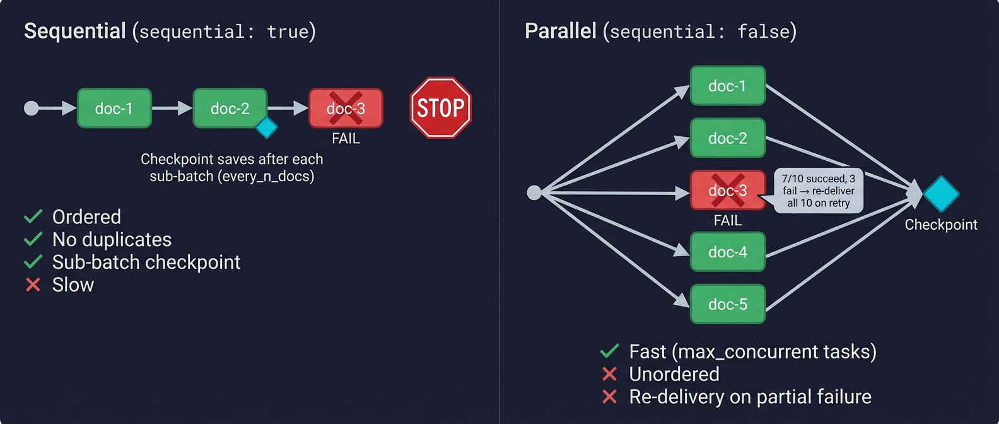
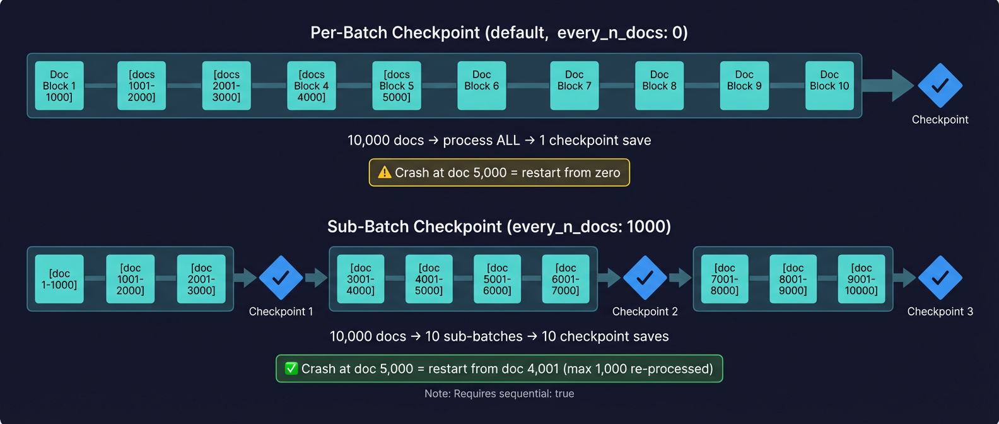

# Changes Worker – Design & Failure Modes

This document describes the internal architecture of the changes_worker, how data flows through the system, and what happens when things go wrong at every stage.

**Related docs:**
- [`ADMIN_UI.md`](ADMIN_UI.md) -- Dashboard, config editor, and schema mapping UI
- [`CBL_DATABASE.md`](CBL_DATABASE.md) -- Embedded Couchbase Lite storage schema
- [`JOBS.md`](JOBS.md) -- Job ID concept, per-engine/per-job OUTPUT metrics
- [`SCHEMA_MAPPING.md`](SCHEMA_MAPPING.md) -- JSON-to-relational mapping definitions
- [`RDBMS_PLAN.md`](RDBMS_PLAN.md) -- RDBMS output architecture and config
- [`RDBMS_IMPLEMENTATION.md`](RDBMS_IMPLEMENTATION.md) -- RDBMS implementation guide (single-table, multi-table, transactions)
- [`CLOUD_BLOB_PLAN.md`](CLOUD_BLOB_PLAN.md) -- Cloud blob storage output (S3, GCS, Azure)
- [`ADMIN_UI.md — Transforms`](ADMIN_UI.md#transform-functions-reference-transforms) -- Transform function reference (58 built-in functions)

---

## Three-Stage Pipeline


| Stage | What it does |
|---|---|
| **LEFT** | Consume `_changes` on SG / App Services / Edge Server / CouchDB via longpoll, continuous (2-phase: batched catch-up → streaming), websocket (SG / App Services only), SSE (Edge Server only), or eventsource (CouchDB). Returns a batch of changes with `last_seq`. |
| **MIDDLE** | Filter (skip deletes/removes), optionally fetch full docs via `_bulk_get`, serialize to the output format, manage checkpoints. |
| **RIGHT** | Forward each doc to the output: configurable HTTP method (`PUT`/`POST`/`PATCH`/`DELETE`) to a REST endpoint with URL templating, write to stdout, write to an RDBMS via the `db/` module (UPSERT/DELETE with optional multi-table transactions), or upload to a cloud blob store via the `cloud/` module (S3, GCS, Azure Blob). Track success/failure per doc. Periodic heartbeat monitors endpoint health. |

The admin UI dashboard mirrors this pipeline with a [charts-first grouped layout](ADMIN_UI.md#charts-row) showing live metrics for each stage.

---

## Sequential vs Parallel Processing



### Sequential (`sequential: true`)

```
change-1 → send → wait → change-2 → send → wait → change-3 → send → wait → checkpoint
```

- Documents are processed **one at a time, in feed order**.
- If a doc fails and `halt_on_failure=true`, processing stops immediately. The checkpoint has not advanced, so the entire batch retries on the next cycle.
- **Safest mode.** No race conditions. No duplicate deliveries. No reordering.
- **Trade-off:** Slow on large batches. A batch of 10,000 docs processes serially — if each PUT takes 50ms, that's ~8 minutes per batch.
- Supports `every_n_docs` sub-batch checkpointing (see below).

### Parallel (`sequential: false`, the default)

```
change-1 → send ─┐
change-2 → send ─┤ (up to max_concurrent tasks)
change-3 → send ─┤
...              ─┘→ await all → checkpoint
```

- Documents are processed **concurrently** using `asyncio.gather`, limited by `max_concurrent` (default 20).
- Much faster on large batches. Same 10,000 docs at 50ms each with `max_concurrent=20` → ~25 seconds.
- **Trade-offs:**
  - **Delivery order is not guaranteed.** Doc 500 may arrive at the endpoint before doc 1.
  - **Partial failure creates a race condition.** If 3 of 10 tasks fail but 7 succeed, the endpoint has already received 7 docs. With `halt_on_failure=true`, the checkpoint does NOT advance, so the next cycle re-fetches the same batch and those 7 docs get **re-delivered** (at-least-once semantics).
  - **Dead letter queue is more likely to be needed.** With `halt_on_failure=false`, failed docs go to the DLQ and the checkpoint advances — no re-delivery, but no retry either.
  - Does NOT support `every_n_docs` sub-batch checkpointing (checkpoint saves once after the full batch).

### Which should I use?

| Scenario | Recommendation |
|---|---|
| Data correctness is paramount, order matters | `sequential: true` |
| High throughput, endpoint is idempotent (PUT is safe to retry) | `sequential: false` |
| Large catch-up from `since=0` with 100K+ docs | `feed_type: continuous` (auto-batches catch-up), or `sequential: true` + `every_n_docs: 1000` + `throttle_feed: 10000` |
| Low-volume steady-state (< 100 changes per poll) | Either works, default parallel is fine |

---

## Continuous Feed Mode (`feed_type: continuous`)


The worker supports a **two-phase continuous mode** that avoids the timeout and memory issues of consuming large `_changes` feeds in a single request, while still providing real-time change notifications once caught up.

### Phase 1: Catch-Up (Batched One-Shot Requests)

When starting from `since=0` (or after a long outage), the feed may contain 10,000 to millions of changes. A single `feed=continuous` request with `include_docs=true` on such a large backlog can time out or consume excessive memory.

Instead, the worker uses **batched normal (one-shot) requests** to drain the backlog:

```
GET /_changes?feed=normal&limit=10000&since=0
  → process 10,000 changes, checkpoint

GET /_changes?feed=normal&limit=10000&since=<last_seq>
  → process 10,000 changes, checkpoint

GET /_changes?feed=normal&limit=10000&since=<last_seq>
  → 0 results — caught up!
```

Each batch is a bounded HTTP request/response cycle with a known `limit`. This is reliable even for very large feeds because each request returns at most `continuous_catchup_limit` rows (default: 10,000).

### Phase 2: Live Continuous Stream

Once catch-up completes (0 results returned), the worker opens a **streaming `feed=continuous` connection** with no limit:

```
GET /_changes?feed=continuous&since=<last_seq>&heartbeat=30000

{"seq":"1001","id":"doc1","changes":[{"rev":"2-abc"}],...}
{"seq":"1002","id":"doc2","changes":[{"rev":"1-def"}],...}
(heartbeat blank lines keep the connection alive)
```

Each line of the response is a JSON object representing one change. The worker reads line-by-line via `aiohttp`'s streaming reader, processes each change immediately, and checkpoints after each row.

### Reconnection with Exponential Backoff

If the server becomes unreachable or the stream disconnects:

1. The worker catches the connection error
2. Applies exponential backoff using the `retry` config (`backoff_base_seconds`, `backoff_max_seconds`)
3. Returns to **Phase 1 (catch-up)** before reopening the continuous stream

This ensures no changes are missed after an outage — there may be a backlog that accumulated while the server was down.

```
catch-up → continuous → disconnect → backoff → catch-up → continuous → ...
```

### Configuration

```jsonc
"changes_feed": {
  "feed_type": "continuous",           // Enable 2-phase continuous mode
  "continuous_catchup_limit": 10000,   // Batch size for Phase 1 (default: 500)
  "heartbeat_ms": 30000,              // Keep-alive interval for the stream
  "include_docs": true,               // Applies to both phases
  // poll_interval_seconds is NOT used in continuous mode (no polling)
}
```

| Setting | Purpose |
|---|---|
| `continuous_catchup_limit` | Max rows per catch-up batch. Larger = fewer HTTP round-trips but more memory per batch. |
| `heartbeat_ms` | Heartbeat interval for the continuous stream. The server sends blank lines at this interval to keep the TCP connection alive. |

### When to Use Continuous vs Longpoll

| Scenario | Recommendation |
|---|---|
| Low-latency change notifications needed | `continuous` — changes arrive in real-time, no polling delay |
| Large initial catch-up from `since=0` | `continuous` — Phase 1 handles it safely in batches |
| Simple deployment, fewer moving parts | `longpoll` — simpler, no streaming state to manage |
| Endpoint has aggressive connection timeouts | `longpoll` — each request is a short-lived HTTP call |
| Behind a load balancer that breaks long connections | `longpoll` — continuous streams may be terminated by proxies |

---

## WebSocket Feed Mode (`feed_type: websocket`)

The worker supports a **two-phase WebSocket mode** that follows the same catch-up pattern as continuous mode, but uses a real WebSocket connection for the live streaming phase instead of HTTP chunked streaming.

### Phase 1: Catch-Up (Batched One-Shot Requests)

Identical to continuous mode — the worker uses **batched normal (one-shot) HTTP requests** to drain any backlog before switching to WebSocket streaming:

```
GET /_changes?feed=normal&limit=10000&since=0
  → process 10,000 changes, checkpoint

GET /_changes?feed=normal&limit=10000&since=<last_seq>
  → process 10,000 changes, checkpoint

GET /_changes?feed=normal&limit=10000&since=<last_seq>
  → 0 results — caught up!
```

### Phase 2: Live WebSocket Stream

Once catch-up completes, the worker opens a **WebSocket connection** to the `_changes` endpoint:

1. The HTTP URL is converted to a WebSocket URL (`http://` → `ws://`, `https://` → `wss://`)
2. A real WebSocket protocol connection is established (not an HTTP GET with a `feed=websocket` parameter)
3. After connecting, the worker sends a JSON payload with parameters:

```json
{"since": "<last_seq>", "include_docs": true, "active_only": true, "channels": "channel1,channel2"}
```

4. The server streams change rows as WebSocket messages, each being a JSON array of change objects:

```json
[{"seq":"1001","id":"doc1","changes":[{"rev":"2-abc"}],"doc":{...}}]
[{"seq":"1002","id":"doc2","changes":[{"rev":"1-def"}],"doc":{...}}]
```

5. When the server has sent all current changes, it sends a final message containing only `last_seq` (no `id` field), signaling the end of the current batch:

```json
{"last_seq": "1002"}
```

6. The worker then reconnects immediately to wait for new changes.

### Reconnection with Exponential Backoff

Same as continuous mode — if the WebSocket connection drops or the server becomes unreachable:

1. The worker catches the connection error
2. Applies exponential backoff using the `retry` config (`backoff_base_seconds`, `backoff_max_seconds`)
3. Returns to **Phase 1 (catch-up)** before reopening the WebSocket stream

```
catch-up → websocket → disconnect → backoff → catch-up → websocket → ...
```

### Configuration

```jsonc
"changes_feed": {
  "feed_type": "websocket",           // Enable 2-phase WebSocket mode
  "include_docs": true,               // Applies to both phases
  "active_only": true,                // Only active (non-deleted) changes
  "channels": []                      // Channel filter (empty = all channels)
}
```

### When to Use WebSocket vs Continuous

| Scenario | Recommendation |
|---|---|
| Infrastructure is WebSocket-friendly (no HTTP-only proxies) | `websocket` — binary framing avoids chunked-encoding issues |
| Target is Sync Gateway or App Services | `websocket` — supported and optimized |
| Target is Edge Server or CouchDB | `continuous` — WebSocket feed is **not** available |
| Real-time streaming with reliable framing | `websocket` — message boundaries are explicit, no line-parsing needed |
| Simpler HTTP-only deployment | `continuous` — no WebSocket upgrade required |

---

## Checkpoint Strategy



The checkpoint records the highest sequence number that has been **fully processed and delivered**. It is stored on Sync Gateway as a `_local/` document (CBL-compatible format).

### Per-Batch Checkpointing (default)

```
poll → get 500 changes → process all 500 → save checkpoint(last_seq=500)
poll → get 50 changes  → process all 50  → save checkpoint(last_seq=550)
```

The checkpoint saves **once per batch, after every doc in the batch is processed.** This is the simplest and safest approach. If the worker crashes mid-batch, it restarts from the previous checkpoint and re-processes the batch.

**Problem:** A `since=0` catch-up returning 100,000 changes in one batch means one checkpoint save at the end. Crash at doc 50,000 = restart from zero.

**Solution:** Use `throttle_feed` to break large feeds into smaller batches at the API level:

```jsonc
"throttle_feed": 10000  // 100K docs → 10 batches of 10K, 10 checkpoint saves
```

### Sub-Batch Checkpointing (`every_n_docs`)

For even finer granularity within a batch, set `checkpoint.every_n_docs`:

```jsonc
"checkpoint": {
  "every_n_docs": 1000  // save checkpoint every 1000 docs within a batch
}
```

```
poll → get 5000 changes →
  process docs 1-1000    → save checkpoint(seq of doc 1000)
  process docs 1001-2000 → save checkpoint(seq of doc 2000)
  process docs 2001-3000 → save checkpoint(seq of doc 3000)
  ...
```

**Requires `sequential: true`.** Each change in the `_changes` feed has its own `seq` value. In sequential mode, we know that all docs up to the current one have been processed, so we can safely advance the checkpoint to that doc's `seq`. In parallel mode, docs are processed out of order, so we can't determine a safe checkpoint boundary mid-batch.

### Checkpoint Save Cost

Each checkpoint save is a `PUT` to `{keyspace}/_local/checkpoint-{uuid}` on Sync Gateway. This is a lightweight metadata write — not a full document mutation — so it's fast (typically < 5ms). Even with `every_n_docs: 100` on a 10K batch, that's 100 checkpoint saves × 5ms = 0.5 seconds of overhead.

**Do NOT set `every_n_docs: 1`.** That saves a checkpoint after every single doc, which adds unnecessary overhead and load on SG. Values of 100–1000 are practical.

### Local Checkpoint Fallback

When the primary checkpoint on SG is unreachable, the worker falls back to local storage:

| Storage | When used |
|---|---|
| **CBL** (`checkpoint:{uuid}` doc) | When Couchbase Lite CE is available (`USE_CBL=True`) |
| **File** (`checkpoint.json`) | When CBL is not installed (local dev, legacy deployments) |

The fallback is read on startup if the SG checkpoint fails, and written whenever a checkpoint save to SG fails. See [`docs/CBL_DATABASE.md`](CBL_DATABASE.md) for the full CBL schema.

---

## Failure Modes

### LEFT SIDE – _changes Feed Failures

| Failure | What happens | Recovery |
|---|---|---|
| **SG unreachable** (connection refused, DNS failure) | `RetryableHTTP` retries with exponential backoff (up to `retry.max_retries`). | If retries exhausted, logs error, sleeps `poll_interval_seconds`, then retries the entire poll on the next loop iteration. Checkpoint is NOT advanced. |
| **SG returns 5xx** (server error) | Same as above — retried with backoff. | Same recovery. |
| **SG returns 4xx** (auth failure, bad request) | **Non-retryable.** Logged as error. | **Worker stops the poll loop entirely** (breaks out of `while` loop). This usually means bad credentials or a deleted database — requires manual intervention. |
| **SG returns 3xx** (redirect) | **Non-retryable.** Logged as error. | Same as 4xx — worker stops. |
| **HTTP timeout** (`http_timeout_seconds` exceeded) | Treated as connection error — retried. | Increase `http_timeout_seconds` for large `since=0` catch-ups. |
| **Malformed JSON response** | `json.loads` raises, caught as generic exception. | Logged, retried on next loop iteration. |
| **Continuous stream EOF** | Server closes the streaming connection. | Worker logs a warning, applies exponential backoff (using `retry` config), returns to catch-up phase, then reopens the stream. No data lost — checkpoint was saved after each processed row. |
| **Continuous stream read error** | Network error during streaming read. | Same as EOF — backoff, catch-up, reconnect. |

**Key guarantee:** The checkpoint is NEVER advanced if the `_changes` poll fails. On restart, the worker picks up from the last saved `since` value.

### MIDDLE – Processing Failures

| Failure | What happens | Recovery |
|---|---|---|
| **`_bulk_get` fails** (when `include_docs=false`) | Retried by `RetryableHTTP`. | If retries exhausted, same as LEFT side — sleeps and retries. No docs are forwarded, checkpoint not advanced. |
| **Individual doc `GET` fails** (Edge Server, no `_bulk_get`) | Each doc fetch is retried independently. | Failed fetches result in the change being forwarded without the full doc body (uses the change metadata as-is). |
| **Serialization error** (e.g., doc can't be converted to XML) | `serialize_doc` raises `ValueError`. | Unhandled — crashes the worker. This is a bug in the data, not a transient failure. Fix the data or use a format that handles the doc structure. |
| **Checkpoint save fails** | Falls back to local CBL doc (or `checkpoint.json` if CBL unavailable). | On next startup, loads from CBL/file. Logged as warning. |

### RIGHT SIDE – Output Failures


This is where most operational failures occur. The behavior depends on `halt_on_failure` and whether a dead letter queue is configured.

#### With `halt_on_failure: true` (default — safest)

| Failure | What happens | Recovery |
|---|---|---|
| **5xx from endpoint** | `RetryableHTTP` retries with backoff (using `output.retry` config). If retries exhausted → raises `OutputEndpointDown`. | Worker stops processing the batch. Checkpoint is NOT advanced. Sleeps `poll_interval_seconds`, then re-fetches the same batch. The endpoint had time to recover. |
| **4xx from endpoint** | **Not retried** (client error = bad request, not transient). Raises `OutputEndpointDown`. | Same as 5xx — stops the batch, holds checkpoint. Fix the data or endpoint, then restart. |
| **3xx from endpoint** | If `follow_redirects=false` (default): **not retried**, raises `OutputEndpointDown`. If `follow_redirects=true`: aiohttp follows the redirect transparently. | Same — holds checkpoint. Fix the URL or enable `follow_redirects`. |
| **Connection refused / timeout** | Retried with backoff. If exhausted → `OutputEndpointDown`. | Same — holds checkpoint. |

**In parallel mode with partial failure:** If 7 of 10 tasks succeed before one raises `OutputEndpointDown`, those 7 docs were already delivered. The checkpoint does NOT advance, so the next cycle re-fetches all 10 and re-delivers the 7. **Your endpoint must be idempotent** (PUT is naturally idempotent; POST is not).

#### With `halt_on_failure: false` (+ dead letter queue)

| Failure | What happens | Recovery |
|---|---|---|
| **5xx / 4xx / 3xx / connection failure** | After retries exhausted, the doc is **skipped**. `send()` returns `{"ok": false, ...}` instead of raising. | The failed doc + error details are written to `failed_docs.jsonl`. The checkpoint advances past this doc. **The doc will NOT be retried automatically.** |

#### RDBMS Output (`mode: db`)

When the output mode is `db`, failures come from the database instead of an HTTP endpoint. The same `halt_on_failure` and DLQ semantics apply:

| Failure | `halt_on_failure=true` | `halt_on_failure=false` |
|---|---|---|
| **Connection lost** | Stop batch, hold checkpoint, reconnect next cycle | Log, DLQ, skip, continue |
| **Constraint violation** (FK, unique, check) | Stop batch, hold checkpoint | DLQ, skip |
| **Transaction deadlock** | Retry with backoff, then stop | Retry, then DLQ |
| **Type mismatch** (e.g., string in INT column) | Stop batch, hold checkpoint | DLQ, skip |

For multi-table writes (one document → multiple tables), all SQL operations are wrapped in a single transaction. If any statement fails, the entire transaction rolls back — no partial writes. See [`RDBMS_IMPLEMENTATION.md`](RDBMS_IMPLEMENTATION.md) for details on single-table vs. multi-table patterns, transaction handling, and the full-record-replace upsert strategy.

PostgreSQL is the first implemented RDBMS engine (`db/db_postgres.py`). It uses `asyncpg` with a connection pool and wraps all operations in a transaction. See [`RDBMS_PLAN.md`](RDBMS_PLAN.md) for the implementation template used for adding MySQL, MSSQL, and Oracle.

**Batch summary is always logged:**
```
INFO  BATCH SUMMARY: 7/10 succeeded, 3 failed (3 written to dead letter queue)
```

---

## Dead Letter Queue


### What it is

When CBL is available, the DLQ stores each failed doc as a CBL document (`dlq:{doc_id}:{timestamp}`) in the `changes-worker.dlq` collection, with full context — error details, the original doc body, and a `retried` flag. The admin UI exposes DLQ entries via REST endpoints for viewing, retrying, and deleting. See [`docs/CBL_DATABASE.md`](CBL_DATABASE.md) for the full DLQ schema.

When CBL is not available, the DLQ falls back to an append-only JSONL file where each line is a failed doc with full context:

```json
{
  "doc_id": "p:12345",
  "seq": "42",
  "method": "PUT",
  "status": 500,
  "error": "Internal Server Error",
  "time": 1768521600,
  "doc": {"_id": "p:12345", "price": 20.0, "_rev": "4-abc123"}
}
```

### When it's used

Only when `halt_on_failure: false` (worker skips failed docs instead of stopping). When CBL is available, entries are stored automatically in the `changes-worker.dlq` collection — no file path needed. The `dead_letter_path` config (e.g., `"failed_docs.jsonl"`) is only used as a fallback when CBL is not installed.

If `halt_on_failure: true`, the worker stops on failure and holds the checkpoint — no docs are lost, no DLQ needed.

### How to drain it

The dead letter queue is **not automatically drained.** It is a record of what failed so an operator or separate process can retry. Options:

1. **Manual replay:**
   ```bash
   # Read each failed doc and retry the PUT
   while IFS= read -r line; do
     doc_id=$(echo "$line" | jq -r '.doc_id')
     doc=$(echo "$line" | jq -c '.doc')
     curl -s -X PUT "http://my-endpoint/api/$doc_id" \
       -H 'Content-Type: application/json' \
       -d "$doc"
   done < failed_docs.jsonl
   ```

2. **Scripted retry with status filtering:**
   ```bash
   # Only retry 5xx failures (transient), skip 4xx (permanent)
   jq -c 'select(.status >= 500)' failed_docs.jsonl | while IFS= read -r line; do
     # ... retry logic
   done
   ```

3. **Clear after successful replay:**
   ```bash
   # Truncate after all entries have been replayed
   > failed_docs.jsonl
   ```

### Container restart behavior

**With CBL:** DLQ data is stored in the `changes-worker.dlq` collection within the CBL database at `/app/data/`. The `docker-compose.yml` mounts a shared `cbl-data` named volume at `/app/data`, so DLQ entries persist across container restarts automatically.

**Without CBL (file fallback):** The DLQ file is written to the container's filesystem by default. **If the container is brought down, the file is lost** unless:

- **Bind-mount the file** in `docker-compose.yml`:
  ```yaml
  volumes:
    - ./failed_docs.jsonl:/app/failed_docs.jsonl
  ```

- **Or use a named volume** with `"dead_letter_path": "data/failed_docs.jsonl"` in config.

When the container restarts, the worker **appends** to the existing file — it does not overwrite or replay it. Old entries from previous runs remain in the file until manually drained.

### Monitoring

The `dead_letter_total` Prometheus metric tracks how many docs have been written to the DLQ since the worker started:

```promql
# Alert if any docs are landing in the dead letter queue
rate(changes_worker_dead_letter_total[5m]) > 0
```

### System & Runtime Metrics

Beyond pipeline counters, the `/_metrics` endpoint exposes live system metrics collected on each scrape via [psutil](https://github.com/giampaolo/psutil). These are useful for capacity planning, leak detection, and container right-sizing.

| Group | Metrics (all prefixed `changes_worker_`) | Why it matters |
|---|---|---|
| **Process CPU** | `process_cpu_percent`, `process_cpu_user_seconds_total`, `process_cpu_system_seconds_total` | Spot CPU-bound bottlenecks; user vs system split shows if time is in Python code vs kernel (I/O). |
| **Process Memory** | `process_memory_rss_bytes`, `process_memory_vms_bytes`, `process_memory_percent` | RSS is the real footprint. A rising RSS over hours indicates a leak. VMS tracks the virtual address space. |
| **Threads** | `process_threads`, `python_threads_active` | OS thread count includes aiohttp workers; Python count tracks `threading.Thread` objects (CBL maintenance scheduler, etc.). |
| **Python GC** | `python_gc_gen{0,1,2}_count`, `python_gc_gen{0,1,2}_collections_total` | Gen-2 collection spikes correlate with latency pauses. High gen-0 counts may indicate excessive short-lived object allocation. |
| **File Descriptors** | `process_open_fds` | Tracks open files and sockets. A steady climb suggests descriptor leaks (unclosed connections). |
| **System CPU** | `system_cpu_count`, `system_cpu_percent` | Host-level CPU — useful to detect noisy neighbors in shared environments. |
| **System Memory** | `system_memory_total/available/used_bytes`, `system_memory_percent`, `system_swap_total/used_bytes` | Low available memory or swap usage suggests the container needs more RAM. |
| **Disk** | `system_disk_total/used/free_bytes`, `system_disk_percent` | Root partition usage. Important for log rotation and CBL database growth. |
| **Network I/O** | `system_network_bytes_sent/recv_total`, `system_network_packets_sent/recv_total`, `system_network_errin/errout_total` | Total bytes/packets across all interfaces. Error counters flag network-layer problems. |
| **Storage** | `log_dir_size_bytes`, `cbl_db_size_bytes` | Tracks the log directory and CBL database directory sizes. Helps alert before disk fills up. |

**Example Grafana alerts:**

```promql
# Process RSS exceeding container memory limit
changes_worker_process_memory_rss_bytes > 512 * 1024 * 1024

# Disk filling up
changes_worker_system_disk_percent > 85

# File descriptor leak (steadily climbing)
delta(changes_worker_process_open_fds[1h]) > 50

# Log directory growing beyond 1 GB
changes_worker_log_dir_size_bytes > 1073741824
```

---

## Putting It All Together – Recommended Configurations

### Maximum Safety (no data loss, strict order)

```jsonc
{
  "processing": {
    "sequential": true,
    "max_concurrent": 1
  },
  "checkpoint": {
    "every_n_docs": 1000
  },
  "output": {
    "halt_on_failure": true
    // no dead_letter_path needed — worker stops on failure
  }
}
```

- Sequential processing, one doc at a time, in order.
- Checkpoint every 1000 docs — crash loses at most 1000.
- Any output failure stops the worker and freezes the checkpoint.
- On restart, re-processes from last checkpoint. No data lost. No duplicates.
- **Slowest but safest.**

### Maximum Throughput (at-least-once, idempotent endpoint)

```jsonc
{
  "processing": {
    "sequential": false,
    "max_concurrent": 50
  },
  "checkpoint": {
    "every_n_docs": 0
  },
  "output": {
    "halt_on_failure": true
  }
}
```

- Parallel processing, up to 50 concurrent tasks.
- Checkpoint per-batch (default).
- Output failure stops the batch — the next cycle re-delivers any docs from the partial batch.
- **Requires an idempotent endpoint** (PUT is safe; POST may create duplicates). Use `write_method: "PUT"` (default) for idempotent upserts.
- Use `throttle_feed` for large catch-ups to keep batch sizes manageable.

### Best Effort (skip failures, log everything)

```jsonc
{
  "processing": {
    "sequential": false,
    "max_concurrent": 20
  },
  "output": {
    "halt_on_failure": false,
    "dead_letter_path": "failed_docs.jsonl"
  }
}
```

- Parallel processing.
- Failed docs are logged to the dead letter queue and skipped.
- Checkpoint advances regardless — failed docs are NOT retried automatically.
- **Fastest, but data can be lost if the DLQ is not drained.**
- Best for non-critical pipelines where occasional data loss is acceptable (e.g., analytics, search indexing).

---

## Data Flow Diagram

```
                                    ┌─────────────────────────────────┐
                                    │         SUCCESS PATH            │
                                    │                                 │
  _changes ──► filter ──► fetch ──► send ──► 2xx/OK ──► checkpoint ──►  │
    (LEFT)     (MIDDLE)   (MIDDLE)  (RIGHT)             (MIDDLE)    sleep│
                                    │ HTTP: PUT/POST/PATCH/DELETE to endpoint │
                                    │ DB:   UPSERT/DELETE via db/ module │
                                    │ stdout: print to console           │
                                    │                                 │
                                    ├─────────────────────────────────┤
                                    │     FAILURE + halt_on_failure    │
                                    │                                 │
                                    │  send ──► 4xx/5xx/timeout       │
                                    │    └──► retry (backoff)         │
                                    │         └──► exhausted          │
                                    │              └──► STOP batch    │
                                    │                   checkpoint    │
                                    │                   NOT advanced  │
                                    │                   sleep ──► retry│
                                    │                                 │
                                    ├─────────────────────────────────┤
                                    │    FAILURE + !halt_on_failure    │
                                    │                                 │
                                    │  send ──► 4xx/5xx/timeout       │
                                    │    └──► retry (backoff)         │
                                    │         └──► exhausted          │
                                    │              └──► DLQ write     │
                                    │                   skip doc      │
                                    │                   continue      │
                                    │                   checkpoint    │
                                    │                   ADVANCES      │
                                    └─────────────────────────────────┘
```
